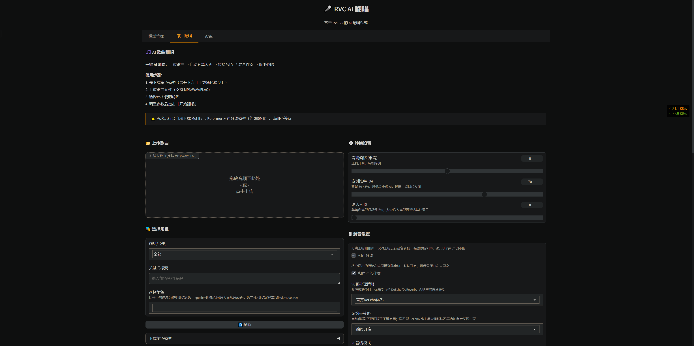
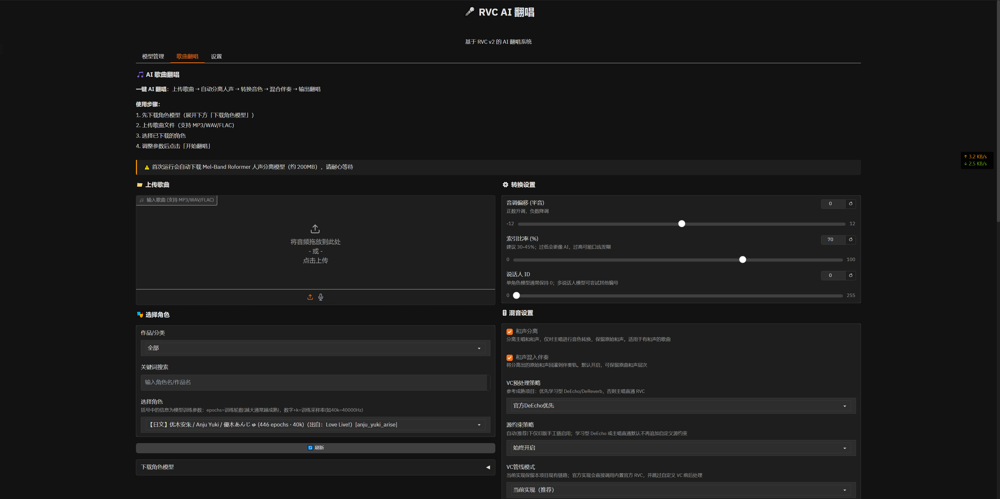

# AI-RVC 一键 AI 翻唱

基于 RVC v2 的一键 AI 翻唱系统，自动完成人声分离、音色转换、混音合成全流程。

**平台支持：Windows / Linux / WSL2**



## 功能特点

- **AI 歌曲翻唱**：上传歌曲自动分离人声、转换音色、混合伴奏，一键生成翻唱
- **人声分离**：默认 BS-RoFormer 强模型（`model_bs_roformer_ep_317_sdr_12.9755.ckpt`），保留 KimberleyJensen Mel-Band RoFormer 作为稳定回退；可选 UVR5、Demucs
- **音色转换**：RVC v2 架构 + 官方 VC 管道，适配角色模型 + FAISS 检索增强流程
- **RMVPE 音高提取**：按 RMVPE 论文报告，在公开基准上优于 CREPE / pYIN / SWIPE 等基线并具备更好噪声鲁棒性
- **角色模型**：内置可下载角色清单 117 项（以 `tools/character_models.py` 为准）
- **混音效果**：支持人声混响、音量调节、原声混合
- **混音预设**：4 种预设（通用、人声突出、伴奏突出、现场感），一键应用
- **卡拉OK模式**：分离主唱和伴唱轨道，支持独立处理和混合
- **VC预处理**：4 种模式（自动、直通、学习型DeEcho、旧版手工链），灵活控制人声预处理
- **双VC管道**：支持当前实现和官方实现，可对比效果
- **GPU 加速**：自动检测并使用 CUDA / ROCm / XPU / DirectML / MPS / CPU
- **简洁界面**：基于 Gradio 的中文图形界面，支持 Web 和 Colab

## 平台支持

| 平台 | 状态 | 安装方式 | 说明 |
|------|------|---------|------|
| Windows 10/11 (x64) | ✅ 已支持 | 可执行文件 / 本地安装 | 推荐使用可执行文件，无需安装 Python |
| Linux (Ubuntu/Debian) | ✅ 已支持 | 可执行文件 / 本地安装 | 推荐 Ubuntu 22.04+，完全兼容 |
| WSL2 (Windows 11) | ✅ 已支持 | 本地安装 | 可直接通过浏览器访问 `http://127.0.0.1:7860` |
| Google Colab | ✅ 已支持 | 在线使用 | 免费 GPU 加速（T4/V100） |
| Hugging Face Spaces | ✅ 已支持 | 在线使用 | 免费 CPU / 付费 GPU |
| macOS | ⚠️ 未充分验证 | 本地安装 | 可尝试 CPU 模式；MPS 路径尚未适配 |

## 快速开始

> **💡 推荐方式**：
> - **新手用户**：使用方式 1（可执行文件），无需安装 Python，开箱即用
> - **开发者/频繁使用**：使用方式 4（本地安装），运行 `python install.py` 一键完成环境配置
> - **临时体验**：使用方式 2（Google Colab）或方式 3（Hugging Face Spaces）

### 方式 1：可执行文件（推荐新手，无需安装 Python）

#### Windows

1. 从 [Releases](https://github.com/mason369/AI-RVC/releases/latest) 下载 `AI-RVC-Windows-Portable.zip`
2. 解压到任意目录
3. 双击 `AI-RVC-Windows.exe` 启动
4. 浏览器自动打开 http://127.0.0.1:7860

#### Linux

1. 从 [Releases](https://github.com/mason369/AI-RVC/releases/latest) 下载 `AI-RVC-Linux-Portable.tar.gz`
2. 解压：`tar -xzf AI-RVC-Linux-Portable.tar.gz`
3. 添加执行权限：`chmod +x AI-RVC-Linux-Portable/AI-RVC-Linux`
4. 运行：`./AI-RVC-Linux-Portable/AI-RVC-Linux`
5. 浏览器访问 http://127.0.0.1:7860

**优势**：
- ✅ 无需安装 Python 和依赖
- ✅ 开箱即用，双击启动
- ✅ 包含所有必需模型
- ⚠️ 仅支持 CPU 推理（构建时使用 CPU 版 PyTorch 以控制包体积）
- 💡 如需 GPU 加速，请使用方式 4 本地安装（`python install.py`）
- ⚠️ 首次启动需要 5-10 分钟下载模型

### 方式 2：Google Colab（推荐临时使用）



1. 打开 Colab notebook：[AI_RVC_Colab.ipynb](https://colab.research.google.com/github/mason369/AI-RVC/blob/master/AI_RVC_Colab.ipynb)
2. 确保运行时类型设置为 **GPU**（菜单栏 → 代码执行程序 → 更改运行时类型 → T4 GPU）
3. 按顺序执行每个单元格
4. 启动 Gradio 界面后，点击生成的公共链接访问

**优势**：
- 无需本地安装，开箱即用
- 免费 GPU 加速（T4/V100）
- 自动配置环境和依赖
- 支持所有功能（翻唱、角色模型下载、混音预设等）

### 方式 3：Hugging Face Spaces（在线体验）

访问：https://huggingface.co/spaces/mason369/AI-RVC

**优势**：
- 无需安装，直接使用
- 随时随地访问
- 易于分享

**限制**：
- 免费版使用 CPU（处理较慢）
- 可升级到 GPU（付费）

### 方式 4：本地安装（推荐开发者和频繁使用）

#### 一键安装（推荐）

**Windows**

```powershell
# 1. 克隆仓库
git clone https://github.com/mason369/AI-RVC.git
cd AI-RVC

# 2. 运行一键安装脚本（自动创建虚拟环境、安装依赖）
python install.py

# 脚本会自动：
# - 检测并创建 Python 3.10 虚拟环境
# - 安装 PyTorch（自动检测 CUDA/CPU）
# - 安装所有项目依赖
# - 启动 Web 界面（首次运行时会自动下载基础模型）
```

**Linux / WSL2**

```bash
# 1. 克隆仓库
git clone https://github.com/mason369/AI-RVC.git
cd AI-RVC

# 2. 运行一键安装脚本
python3.10 install.py

# 或仅检查环境（不安装）
python3.10 install.py --check

# 或安装 CPU 版本
python3.10 install.py --cpu
```

**脚本选项**：
- 无参数：完整安装 + 自动启动
- `--check`：仅检查环境和依赖，不安装
- `--cpu`：安装 CPU 版本 PyTorch（无 GPU 加速）
- `--no-run`：安装完成后不自动启动

> 脚本会自动创建 `venv310` 虚拟环境并在其中安装所有依赖。安装后手动启动请使用虚拟环境中的 Python：
> - Windows：`venv310\Scripts\python run.py`
> - Linux：`venv310/bin/python run.py`

访问 http://127.0.0.1:7860 打开界面。

首次运行翻唱时，audio-separator 会自动下载分离模型并缓存在 `assets/separator_models/`（体积随上游模型版本变化，通常为数百 MB）。

---

#### 手动安装（高级用户）

如果需要自定义安装流程，可以手动执行以下步骤：

**Windows**

```powershell
# 1. 克隆仓库
git clone https://github.com/mason369/AI-RVC.git
cd AI-RVC

# 2. 创建虚拟环境
python -m venv venv310
.\venv310\Scripts\Activate.ps1

# 3. 安装 PyTorch（先在官方页面生成与你环境匹配的命令）
# https://pytorch.org/get-started/locally/
# 示例（CUDA 12.6，2026-03-06）
pip install torch torchaudio --index-url https://download.pytorch.org/whl/cu126
# CPU 示例
# pip install torch torchaudio --index-url https://download.pytorch.org/whl/cpu

# 4. 安装项目依赖
pip install -r requirements.txt

# 5. 下载基础模型（HuBERT、RMVPE）
python tools/download_models.py

# 6. 启动
python run.py
```

**Linux / WSL2**

```bash
# 1. 克隆仓库
git clone https://github.com/mason369/AI-RVC.git
cd AI-RVC

# 2. 创建虚拟环境
python3.10 -m venv venv310
source venv310/bin/activate

# 3. 安装 PyTorch + 依赖
# 先在 https://pytorch.org/get-started/locally/ 生成命令
pip install torch torchaudio --index-url https://download.pytorch.org/whl/cu126
pip install -r requirements.txt

# 4. 下载基础模型 + 启动
python tools/download_models.py
python run.py
```

---

**Linux 兼容性说明**：
- ✅ 所有核心功能完全兼容 Linux
- ✅ 路径处理使用 `pathlib.Path`，跨平台兼容
- ✅ 虚拟环境激活脚本自动适配（`bin/activate` vs `Scripts/Activate.ps1`）
- ✅ 音频处理库（librosa, soundfile, ffmpeg）在 Linux 上表现更稳定
- ✅ GPU 加速（CUDA/ROCm）完全支持
- ⚠️ 部分依赖（如 `fairseq`）在 Linux 上编译更快

**安装脚本说明**：
- `install.py` 会自动检测系统环境（Windows/Linux）并完成以下步骤：
  1. **检测 Python 3.10**：Windows 检查常见安装路径 + `py -3.10` 启动器；Linux 使用 `python3.10` 命令
  2. **创建虚拟环境**：在 `venv310/` 目录创建隔离的 Python 环境
  3. **安装 PyTorch**：自动检测 CUDA 可用性，安装对应版本（GPU/CPU）
  4. **安装项目依赖**：从 `requirements.txt` 安装所有必需包（包括 fairseq、audio-separator 等）
  5. **启动应用**：自动运行 `run.py` 启动 Web 界面（除非使用 `--no-run`）
- 基础模型（HuBERT、RMVPE）会在首次运行时由 `run.py` 自动下载
- 支持参数：`--check`（仅检查）、`--cpu`（CPU 版本）、`--no-run`（不自动启动）
- 如果虚拟环境已存在，会跳过创建步骤，直接检查依赖

## 依赖版本说明

| 依赖 | 版本要求 | 说明 |
|------|----------|------|
| Python | 3.10+ | 推荐 3.10 |
| PyTorch | >= 2.0.0 | 语音转换 + 人声分离 |
| torchaudio | >= 2.0.0 | 与 PyTorch 版本对应 |
| CUDA | 与 torch wheel 匹配 | 常见 11.8 / 12.1 / 12.4 / 12.6（可选） |
| fairseq | 0.12.2 | HuBERT 特征提取 |
| audio-separator | latest | Mel-Band Roformer 人声分离 |
| demucs | >= 4.0.0 | Demucs 人声分离（可选） |

## 使用方法

### 歌曲翻唱（推荐）

1. 进入「歌曲翻唱」标签页
2. **下载角色模型**（首次使用）：
   - 展开「下载角色模型」折叠面板
   - 可按系列筛选或关键词搜索
   - 点击「下载选中角色」下载单个角色
   - 或点击「下载该分类全部」批量下载
3. **上传歌曲**：支持 MP3/WAV/FLAC 格式
4. **选择角色**：从已下载的角色列表中选择
5. **调整参数**：
   - 基础参数：音调偏移、索引率、说话人ID
   - 卡拉OK设置：启用主唱/伴唱分离
   - VC预处理模式：自动/直通/学习型DeEcho/旧版手工链
   - 源约束策略：自动/关闭/启用
   - VC管道模式：当前实现/官方实现
   - 混音预设：通用/人声突出/伴奏突出/现场感
   - 混音参数：人声音量、伴奏音量、混响、RMS混合率
6. **开始翻唱**：点击「🚀 开始翻唱」按钮
7. **下载结果**：
   - 最终翻唱（混合后的完整作品）
   - 转换后的人声
   - 原始人声
   - 主唱轨道（如启用卡拉OK）
   - 伴唱轨道（如启用卡拉OK）
   - 伴奏

### 角色模型管理

**查看可用角色**：
- 117 个角色，涵盖 Love Live!、原神、Hololive、偶像大师等系列
- 支持按系列筛选和关键词搜索
- 显示格式：【语言】角色名（出处）[内部名]

**下载方式**：
- 单个下载：选择角色后点击「下载选中角色」
- 批量下载：选择系列后点击「下载该分类全部」
- 全部下载：点击「下载全部角色模型」（需要较长时间）

**已下载角色**：
- 自动刷新列表
- 支持按系列筛选和关键词搜索
- 点击「刷新」按钮手动更新

## 支持的格式

**输入**：MP3, WAV, FLAC（UI 明确支持；其他格式取决于后端解码器）

**输出**：WAV（翻唱成品 + 分离人声 + 伴奏）

## 技术架构

```
音频输入 → CoverPipeline
              ↓
          ┌─ 步骤 1：人声分离 ─────────────────────────────┐
          │  Mel-Band Roformer (默认) / UVR5 / Demucs      │
          │      ↓                                         │
          │  人声 (vocals.wav) + 伴奏 (accompaniment.wav)  │
          └────────────────────────────────────────────────┘
              ↓
          ┌─ 步骤 2：RVC 语音转换 ─────────────────────────┐
          │  HuBERT 特征提取 → RMVPE F0 提取               │
          │      ↓                                         │
          │  RVC v2 推理（角色模型 + FAISS 索引检索）       │
          │      ↓                                         │
          │  转换后人声 (converted_vocals.wav)              │
          └────────────────────────────────────────────────┘
              ↓
          ┌─ 步骤 3：混音 ─────────────────────────────────┐
          │  转换人声 + 伴奏 → 音量调节 + 混响             │
          │      ↓                                         │
          │  AI 翻唱成品 (cover.wav)                       │
          └────────────────────────────────────────────────┘
```

### 使用的 AI 模型

本项目翻唱流水线由四个核心模型组成：

| 环节 | 模型 | 用途 |
|------|------|------|
| 人声分离 | BS-RoFormer + Mel-Band RoFormer 回退 | 从混音中分离人声与伴奏 |
| 特征提取 | HuBERT Base | 提取语音内容特征供 RVC 使用 |
| 音高提取 | RMVPE | 从人声中提取 F0 基频曲线 |
| 语音转换 | RVC v2 | 将人声音色转换为目标角色 |

---

### 人声分离模型：BS-RoFormer（默认）+ Mel-Band RoFormer（回退）

默认使用 **Mel-Band Roformer** 进行人声/伴奏分离，通过 [audio-separator](https://github.com/nomadkaraoke/python-audio-separator) 库调用。

| 项目 | 详情 |
|------|------|
| 模型全称 | BS-RoFormer / Mel-Band RoFormer fallback |
| 论文 | [Mel-Band RoFormer for Music Source Separation](https://arxiv.org/abs/2310.01809) (ByteDance) |
| 默认检查点 | `model_bs_roformer_ep_317_sdr_12.9755.ckpt` |
| 回退检查点 | `model_bs_roformer_ep_368_sdr_12.9628.ckpt` → `vocals_mel_band_roformer.ckpt` |
| 公开对比 | audio-separator 本地模型列表中 `model_bs_roformer_ep_317_sdr_12.9755.ckpt` 的 Instrumental SDR 为 **16.5**，适合翻唱链路保持更干净伴奏 |
| 模型文件体积 | 由上游发布决定（会变化）；首次运行自动下载到 `assets/separator_models/` |
| 调用方式 | 通过 [audio-separator](https://github.com/nomadkaraoke/python-audio-separator) 库封装 |
| 首次使用 | 自动下载并缓存到 `assets/separator_models/` |

核心思想：将频谱按 mel-scale 频段划分后独立建模，用 RoPE 增强时序建模，相比 BS-RoFormer 的线性频段划分更符合人耳感知特性。

#### MVSEP 公开 Multisong 指标摘录（2026-03-06）

> 统一记法：`Vocals SDR / Instrum SDR`（dB）。

| 模型 | Vocals SDR | Instrum SDR | 备注 |
|------|------------|-------------|------|
| `htdemucs` | 8.38 | 16.31 | Demucs 基线 |
| `htdemucs_ft` | 9.40 | 16.86 | Demucs 微调版 |
| `bs_roformer_viperx_1053` | 10.87 | 17.17 | BS-Roformer |
| `mel_band_roformer_vocals_kimberleyjensen` | 11.01 | 17.32 | 稳定回退 |
| `bs_roformer_ep_368_sdr_12.9628` | 11.89 | 17.84 | BS-RoFormer 强候选 |

> 说明：不同数据集/协议不可直接横比；本仓库默认改为本地可运行的 BS-RoFormer 强模型，并保留 KimberleyJensen 作为兼容回退。

---

### 语音转换模型：RVC v2

使用 **RVC v2**（Retrieval-based Voice Conversion v2）进行人声音色转换。

| 项目 | 详情 |
|------|------|
| 模型全称 | Retrieval-based Voice Conversion v2 |
| 来源 | [RVC-Project](https://github.com/RVC-Project/Retrieval-based-Voice-Conversion-WebUI) |
| 架构 | HuBERT 特征提取 → F0 条件 → 生成器 + FAISS 索引检索 |
| 特征提取器 | HuBERT Base（`hubert_base.pt`，~190 MB） |
| 训练数据 | 各角色模型独立训练（规模依模型作者而异） |
| 模型生态（第三方聚合站） | [voice-models.com](https://voice-models.com/) 列表页显示 **201,964**（2026-03-06 访问，含重复与质量差异） |
| 许可证 | MIT |

#### 同领域语音转换框架对比

| 框架 | 来源 | 架构 | 说明 |
|------|------|------|------|
| [RVC v2](https://github.com/RVC-Project/Retrieval-based-Voice-Conversion-WebUI)（当前） | RVC-Project | HuBERT + 检索增强生成 | 本项目当前采用 |
| [so-vits-svc](https://github.com/PlayVoice/whisper-vits-svc) | PlayVoice | VITS 系列 | 常见开源 SVC 路线 |
| [GPT-SoVITS](https://github.com/RVC-Boss/GPT-SoVITS) | RVC-Boss | GPT + VITS few-shot | 更偏 TTS/语音克隆 |
| [DDSP-SVC](https://github.com/yxlllc/DDSP-SVC) | yxlllc | DDSP | 轻量实时方向 |
| [Seed-VC](https://arxiv.org/html/2407.07728v3) | 研究论文 | 零样本 VC | 研究方向 |

> **结论**：在“角色模型翻唱”工作流里，RVC v2 目前仍是工程上最易落地的选项之一（模型与工具链成熟）。

---

### F0 提取模型：RMVPE

使用 **RMVPE** 从人声中提取基频（F0）曲线，用于保持转换后的音高/旋律。

| 项目 | 详情 |
|------|------|
| 模型全称 | Robust Model for Vocal Pitch Estimation in Polyphonic Music |
| 论文 | [arXiv:2306.15412](https://arxiv.org/abs/2306.15412) |
| 检查点 | `rmvpe.pt`（`assets/rmvpe/`） |
| 核心优势 | 直接从多声道混音中提取人声音高，噪声鲁棒性强 |
| 指标 | 论文报告在 RPA/RCA 等指标上优于 CREPE、pYIN、SWIPE、Harvest 等基线 |

#### 同领域 F0 提取模型对比

| 模型 | 来源 | 说明 |
|------|------|------|
| [RMVPE](https://arxiv.org/abs/2306.15412)（当前） | Dream-High | 当前项目默认方案，兼顾精度与鲁棒性 |
| [FCPE](https://arxiv.org/html/2509.15140) | 2025 论文 | 论文给出 RTF 0.0062、RPA 96.79%（VCTK），实时潜力高 |
| [CREPE](https://github.com/marl/crepe) | NYU MARL | 经典 CNN 方案，生态成熟 |
| [Harvest](https://github.com/mmorise/World) | WORLD | 传统信号处理方案，部署简单 |

> **结论**：默认推荐 RMVPE；若场景强依赖实时性，可关注 FCPE 等新方案。

---

### 特征提取模型：HuBERT Base

| 项目 | 详情 |
|------|------|
| 模型全称 | Hidden-Unit BERT |
| 来源 | [Meta AI / fairseq](https://github.com/facebookresearch/fairseq/tree/main/examples/hubert) |
| 检查点 | `hubert_base.pt`（`assets/hubert/`，~190 MB） |
| 用途 | 提取语音内容特征（去除说话人信息），供 RVC 生成器使用 |
| 说明 | RVC v2 架构绑定 HuBERT Base；WavLM/ContentVec 在其他框架中可能更优，但 RVC 模型基于 HuBERT 训练，不可替换 |

## 参数说明

### 转换参数

| 参数 | 说明 | 建议值 |
|------|------|--------|
| 音调偏移 | 半音数，正数升调，负数降调 | 男转女: +12, 女转男: -12 |
| F0 提取方法 | 音高提取算法 | rmvpe（默认） |
| 索引比率 | 越高越像训练音色 | 0.1-0.5 (10-50%) |
| 滤波半径 | 中值滤波，减少气音抖动 | 3 |
| 保护系数 | 防止撕裂伪影，越小保护越强 | 0.33 |
| RMS 混合率 | 音量包络匹配程度；默认保留 RVC 歌唱主体 | 0.0 (0%) |

### 混音参数（翻唱）

| 参数 | 说明 | 建议值 |
|------|------|--------|
| 人声音量 | 转换后人声的音量 | 100% |
| 伴奏音量 | 背景伴奏的音量 | 100% |
| 人声混响 | 为人声添加空间感 | 10-20% |
| 伴唱混合率 | 伴唱在最终输出中的比例 | 0-100% |

### 混音预设

| 预设 | 人声音量 | 伴奏音量 | 混响 | 说明 |
|------|---------|---------|------|------|
| 通用 | 100% | 100% | 10% | 默认均衡设置 |
| 人声突出 | 115% | 90% | 5% | 突出人声，适合清唱风格 |
| 伴奏突出 | 90% | 115% | 5% | 突出伴奏，适合背景音乐丰富的歌曲 |
| 现场感 | 100% | 100% | 20% | 增加混响，模拟现场演出效果 |

### VC 预处理模式

| 模式 | 说明 | 适用场景 |
|------|------|---------|
| 自动 | 根据模型可用性自动选择 | 推荐，智能选择最佳路径 |
| 直通 | 主唱直接进入 RVC | 干净人声，无需去混响 |
| 学习型 DeEcho | 使用 UVR DeEcho/DeReverb | 需要去除混响和回声 |
| 旧版手工链 | 旧版手工去回声链 | 仅用于对比测试 |

### 源约束策略

| 模式 | 说明 |
|------|------|
| 自动 | 根据场景自动决定 |
| 关闭 | 不使用源约束 |
| 启用 | 强制启用源约束 |

### VC 管道模式

| 模式 | 说明 | 特点 |
|------|------|------|
| 当前实现 | 使用项目自定义 VC 流程 | 支持完整的预处理和后处理 |
| 官方实现 | 使用内置官方 RVC | 切换到官方UVR5 + 原始分离人声直通官方VC，并关闭 Karaoke / DeEcho / 源约束 |

### 人声分离参数 (config.json)

| 参数 | 说明 | 建议值 |
|------|------|--------|
| separator | 分离器类型 | roformer（推荐）、uvr5 或 demucs |
| uvr5_model | UVR5 模型 | HP2_all_vocals |
| uvr5_agg | UVR5 激进度 (1-10) | 6-8（高音问题可降低） |
| demucs_model | Demucs 模型 | htdemucs |
| karaoke_model | 卡拉OK分离模型 | sota_karaoke_ensemble（AUFR33 + GABOX v2 + Becruily，本地SOTA median ensemble） |

## 配置文件

主要配置在 `configs/config.json`：

```json
{
  "device": "cuda",
  "f0_method": "rmvpe",
  "index_rate": 0.1,
  "filter_radius": 3,
  "cover": {
    "separator": "roformer",
    "karaoke_model": "sota_karaoke_ensemble",
    "uvr5_model": "HP2_all_vocals",
    "uvr5_agg": 8,
    "rms_mix_rate": 0.0,
    "protect": 0.33,
    "backing_mix": 0.0
  }
}
```

## 可用角色模型（100+，当前清单 117）

| 系列 | 角色示例 |
|------|----------|
| Love Live! | 星空凛、园田海未、东条希、小泉花阳、南小鸟 |
| Love Live! Sunshine!! | 高海千歌、樱内梨子、黑泽黛雅、黑泽露比、国木田花丸、津岛善子、小原鞠莉、渡边曜、松浦果南 |
| Love Live! 虹咲学园 | 上原步梦、中须霞、天王寺璃奈、近江彼方、优木雪菜、三船栞子、米雅·泰勒 |
| Love Live! Superstar!! | 唐可可、平安名堇 |
| 偶像大师 | 神崎兰子、梦见莉亚梦、双叶杏、本田未央、岛村卯月 |
| 原神 | 芙宁娜、枫原万叶、纳西妲、八重神子、雷电将军 |
| 碧蓝航线 | 埃塞克斯 |
| Hololive | Fuwawa、Mococo |
| 原创 | 爱美 (Aimi) |

> 完整列表请在 UI 中查看「下载角色模型」面板

## 项目结构

```
AI-RVC/
├── venv310/                 # 虚拟环境 (Python 3.10)
├── assets/                  # 模型文件
│   ├── hubert/              # HuBERT 模型 (~190 MB)
│   ├── rmvpe/               # RMVPE 模型
│   ├── uvr5_weights/        # UVR5 人声分离模型
│   ├── separator_models/    # Roformer 人声分离模型 (自动下载)
│   └── weights/             # 用户语音模型
│       └── characters/      # 角色模型 (100+，自动下载)
├── configs/                 # 配置文件
│   └── config.json          # 主配置
├── infer/                   # 推理模块
│   ├── pipeline.py          # 自定义 RVC 推理管道
│   ├── cover_pipeline.py    # 翻唱流水线
│   ├── separator.py         # 人声分离 (Roformer/Demucs)
│   └── modules/             # 官方 VC 模块
│       ├── vc/              # 官方 VC 管道
│       └── uvr5/            # UVR5 人声分离
├── lib/                     # 核心库
│   ├── audio.py             # 音频处理
│   ├── mixer.py             # 混音模块
│   └── logger.py            # 日志系统
├── models/                  # 模型定义
├── tools/                   # 工具脚本
│   ├── download_models.py   # 基础模型下载
│   └── character_models.py  # 角色模型管理
├── ui/                      # Gradio 界面
├── outputs/                 # 输出文件
├── temp/                    # 临时文件
└── run.py                   # 主入口
```

## 常见问题

**Q: CUDA out of memory**

人声分离通常需要约 4GB 以上显存（取决于音频时长和模型），尝试：
- 关闭其他占用显存的程序
- 使用较短的音频（建议 < 5 分钟）
- 在 config.json 中切换 separator 为 demucs 或 uvr5

**Q: 首次运行很慢**

首次运行会自动下载模型文件（大小随模型版本变化），请耐心等待。

**Q: 高音断音/撕裂**

这通常是 F0 提取不稳定导致的，尝试：
- 降低 UVR5 激进度（`uvr5_agg`: 8 → 6-7）
- 若仍有撕裂，将保护系数从默认 `0.33` 逐步降到 `0.2`
- 增大滤波半径（`filter_radius`: 3 → 5）
- 使用更干净的输入音频

**Q: 转换后声音失真**

尝试：降低索引比率、调整音调偏移、使用更高质量的输入音频。

**Q: 角色模型下载失败**

检查网络连接，或手动下载：
```bash
python -c "from tools.character_models import download_character_model; download_character_model('rin')"
```

**Q: faiss AVX512 警告**

正常的回退机制，faiss 会自动使用 AVX2，不影响功能。

**Q: CUDA 不可用**
```bash
nvidia-smi
python -c "import torch; print(torch.cuda.is_available())"
```

**Q: torchaudio DLL 加载失败 / 路径相关报错**

项目路径中不能包含中文或特殊字符（如 `C:\新建文件夹\AI-RVC`），否则 PyTorch/torchaudio 的 C++ 库无法正确加载。请将项目放在纯英文路径下，例如 `C:\AI-RVC` 或 `D:\AI-RVC`。

## 数据核验说明（2026-03-06）

以下外部数据已在 2026-03-06 复核，README 中涉及的关键数字以这些来源为准：

- MVSEP 算法页（Multisong 指标与模型分数）：https://mvsep.com/algorithms
- MVSEP 算法详情（KimberleyJensen / BS-RoFormer 对照）：https://mvsep.com/algorithms/49
- RVC 官方仓库与许可证：https://github.com/RVC-Project/Retrieval-based-Voice-Conversion-WebUI
- 第三方模型聚合计数（voice-models 列表页）：https://voice-models.com/models
- RMVPE 论文：https://arxiv.org/abs/2306.15412
- FCPE 论文：https://arxiv.org/html/2509.15140
- PyTorch 安装页面（当前 CUDA wheel 选择）：https://pytorch.org/get-started/locally/

## 贡献

欢迎提交 Pull Request。

1. Fork 本仓库
2. 创建功能分支：`git checkout -b feature/amazing-feature`
3. 提交更改：`git commit -m 'feat: add amazing feature'`
4. 推送分支：`git push origin feature/amazing-feature`
5. 创建 Pull Request

## 许可证

MIT License

## 致谢

- [RVC-Project](https://github.com/RVC-Project/Retrieval-based-Voice-Conversion-WebUI) - 原始 RVC 项目
- [Mel-Band RoFormer](https://arxiv.org/abs/2310.01809) - 人声分离模型架构论文
- [audio-separator](https://github.com/nomadkaraoke/python-audio-separator) - 音源分离推理框架
- [Music-Source-Separation-Training](https://github.com/ZFTurbo/Music-Source-Separation-Training) - Roformer 预训练权重
- [UVR5](https://github.com/Anjok07/ultimatevocalremovergui) - Ultimate Vocal Remover
- [Demucs](https://github.com/facebookresearch/demucs) - Meta 人声分离
- [RMVPE](https://arxiv.org/abs/2306.15412) - 高质量 F0 提取
- [HuBERT](https://github.com/facebookresearch/fairseq/tree/main/examples/hubert) - 语音特征提取
- [Gradio](https://gradio.app/) - Web 界面框架

## 免责声明

**重要提示：使用本软件前请仔细阅读以下声明**

1. **仅供学习研究**：本项目仅供学习、研究和个人娱乐用途，不得用于任何商业目的。

2. **禁止非法使用**：严禁使用本软件进行以下行为：
   - 未经授权模仿他人声音进行欺诈、诈骗
   - 制作虚假音频用于传播谣言或误导公众
   - 侵犯他人肖像权、名誉权或其他合法权益
   - 任何违反当地法律法规的行为

3. **版权声明**：
   - 使用本软件转换的音频版权归原作者所有
   - 用户需自行获取原始音频和模型的使用授权
   - 本项目内置的角色模型仅供技术演示，请勿用于商业用途

4. **用户责任**：用户对使用本软件产生的所有内容和后果承担全部责任。开发者不对任何滥用行为负责。

5. **无担保声明**：本软件按"原样"提供，不提供任何明示或暗示的担保。

**使用本软件即表示您已阅读、理解并同意以上声明。**
