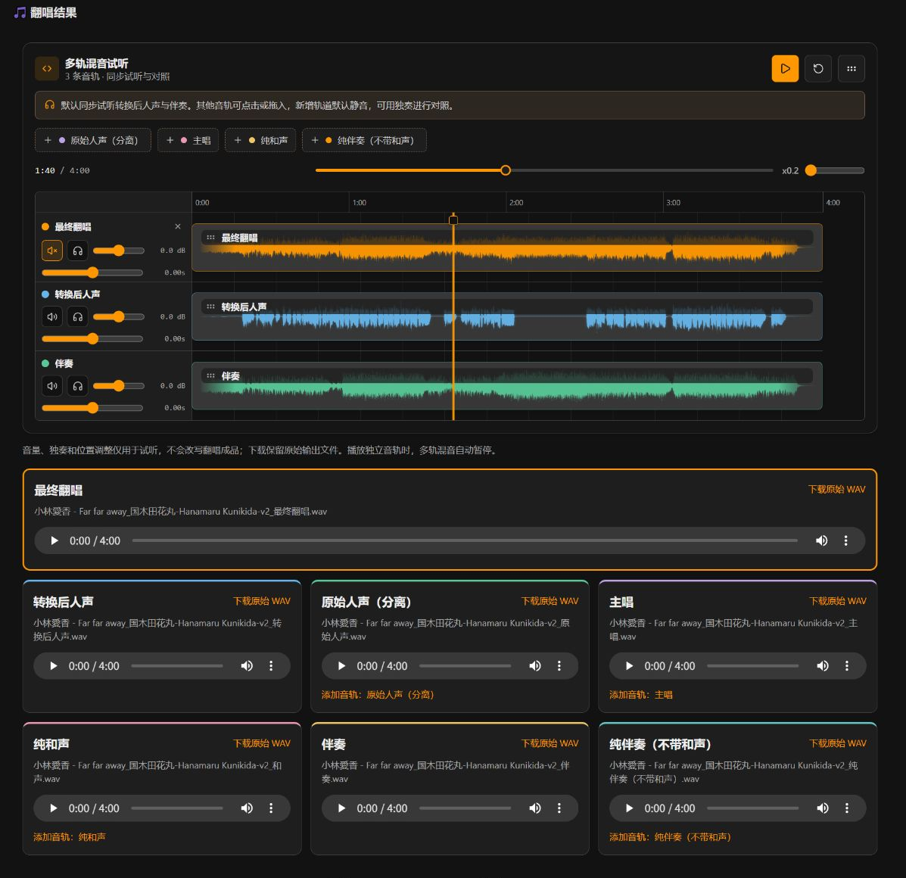
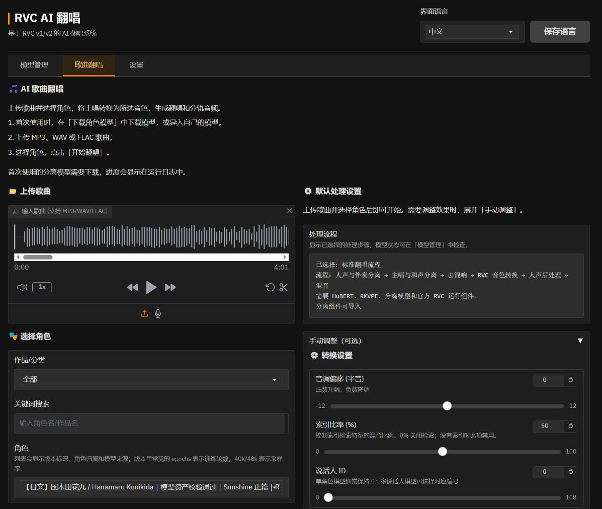
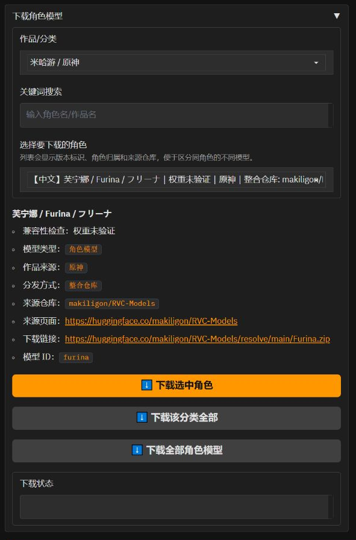

# AI-RVC 一键 AI 翻唱 / RVC Voice Conversion WebUI

AI-RVC 是一个开源的 [RVC v1/v2](https://github.com/RVC-Project/Retrieval-based-Voice-Conversion-WebUI) 翻唱 WebUI。项目包含人声与伴奏分离、主唱与和声分离、F0 提取、RVC 音色转换、FAISS 检索和混音导出，可直接处理 MP3、WAV 和 FLAC 歌曲。

> 在线体验：[TelkNet AI 翻唱](https://telknet.cc/tools/ai-rvc)

**运行入口：Windows / Linux / WSL2 / Docker / Google Colab / Hugging Face Spaces**；各平台验证范围见下文。

**[1.5.1 已发布](https://github.com/mason369/AI-RVC/releases/tag/v1.5.1)**。Windows/Linux CPU/CUDA 四种便携包均完成逐文件校验及默认、官方两条真实翻唱路线，共验证 44 个 Float32 输出；各构建均通过 343 项回归。Release 提供完整分卷、SHA-256、实际运行记录和与 v1.4.1 的全量文件对照。公开 Docker 镜像 `1.5.1-cpu` / `1.5.1-cuda` 均已匿名拉取并完成两条真实路线，另验证 22 个 Float32 输出，见[平台验收](docs/平台适配与验收.md)。部署、持久化和登录用法见 [Docker 使用指南](docs/Docker使用指南.md)，发行核对见[发布与验收](docs/发布准备.md)。

## 界面预览

**同步多轨试听与七类分轨输出。** 转换后人声和伴奏同步播放，可添加成品或原始分轨作对照；每轨独立调节音量、静音、独奏和时间偏移，支持波形缩放与原始 WAV 下载。



**上传、选角色、开始翻唱。** 默认完成 Leap 人声/纯伴奏分离、主唱与和声分离、固定 Stereo De-Reverb 和 RVC 转换。展开手动设置可调整移调、索引率、说话人、混音及和声保留方式。

<details>
<summary>查看翻唱设置与角色下载界面</summary>





</details>

截图采集于 2026-09-06 的本地工作区；波形来自真实歌曲处理结果，只裁切取景，未重绘界面或合成状态。页面共用中英文与响应式布局，截图不表示云端版本已经部署。

## 默认模型速览

| 环节 | 当前默认 | 输入与输出 | 来源 |
|------|----------|------------|------|
| 人声 | [BS-RoFormer Leap XE 90 bands（pcunwa）](https://huggingface.co/pcunwa/BS-Roformer-Leap) | 统一 PCM 整曲 → `vocals.wav` | [MVSep 10178](https://mvsep.com/quality_checker/entry/10178)：Vocals SDR 11.7577、SI-SDR 11.3936 |
| 纯伴奏 | [BS-RoFormer Leap Instrumental 62 bands](https://huggingface.co/pcunwa/BS-Roformer-Leap) | 同一 PCM 整曲 → `accompaniment_without_harmony.wav` | 2026-09-06 本机 30 秒受控复测 SI-SDR 19.28 dB，对照 PolarFormer 18.46 dB；不是原曲真分轨或官方榜单成绩 |
| 主唱 / 带和声伴奏 | `BS-Kar-Gabox_IS + BS-Kar-Frazer&Becruily + BS-Kar-Anvuew (AVG)` | 原始整曲 → `lead_vocals.wav` + `accompaniment.wav`；第二路为 `Back+Instrumental` | [MVSep 9205](https://www.mvsep.com/quality_checker/entry/9205)：三个模型使用 `avg_wave` |
| 和声 | Leap 人声与 MVSep 9205 主唱差分 | `vocals.wav - lead_vocals.wav` → `backing_vocals.wav` | 差分得到的和声轨；可能残留主唱或乐器分离误差 |
| 去混响 | [RoFormer De-Reverb](https://huggingface.co/anvuew/dereverb_bs_roformer) | 主唱 → 较干的人声 | `dereverb_bs_roformer_anvuew_sdr_22.5050.ckpt` |
| 内容特征 | [HuBERT Base](https://arxiv.org/abs/2106.07447) | 人声 → RVC 内容特征 | 新版官方：Transformers 三文件目录；本地兼容：fairseq `.pt` |
| 音高 | [RMVPE](https://arxiv.org/abs/2306.15412) | 人声 → F0 曲线 | `rmvpe.pt` |
| 音色转换 | [RVC v1/v2](https://github.com/RVC-Project/Retrieval-based-Voice-Conversion-WebUI) + [FAISS](https://github.com/facebookresearch/faiss) | 主唱 + `.pth` / `.index` → 转换后人声 | 兼容现有 RVC 角色模型 |

MP3、FLAC 及非标准 WAV 输入会先统一解码为 44.1 kHz 双声道 Float32 WAV，两路 Leap 使用同一份输入。默认 Karaoke 路线只转换主唱；最终混音直接使用 MVSep 的 `Back+Instrumental`，不会再叠加纯伴奏。PolarFormer 的运行路线、专用参数和下载入口已移除，新包排除遗留权重；旧模型配置会明确报错。

### 纯伴奏模型实测分数

默认纯伴奏已经切换为 **标准 Leap Instrumental 62 bands**。以下为 2026-09-06 更新到 audio-separator 0.47.0 后的同机、同输入、串行真实复测；Leap 使用模型 YAML 的重叠配置，保持 FP32。人声模型仍是 Leap XE 90，去混响仍是 Stereo De-Reverb 22.5050。

| 模型 | 30 秒受控样本 SI-SDR ↑ | 同一受控样本处理耗时 |
|---|---:|---:|
| **Leap Instrumental 62（当前默认）** | **19.2844 dB** | **6.15 秒** |
| PolarFormer public ONNX 62（历史对照，已移除） | 18.4565 dB | 126.55 秒 |

Leap 在这一个受控样本中高 **0.8280 dB**，三个连续分段也都领先。评分输入是“钢琴参考＋已有分离人声”的人工混音，没有原曲可靠真值分轨，不能证明所有歌曲都更好。耗时不含模型加载，硬件为 RTX 4070 Ti SUPER。三段分数、输入及模型哈希、评估方法和 0.44.1 历史记录见[伴奏模型实测](docs/伴奏模型实测.md)。新版 Leap 的本次分数较旧版略低，未把依赖升级描述为音质提升。

上表不能与公开排行榜混排：Leap XE 的公开条目 Vocals SDR 为 11.7577、SI-SDR 为 11.3936；`22.5050` 是去混响权重命名中的作者指标，本项目未独立复测该数值。它们均不是当前软件在任意歌曲上的保证分数。

## 界面语言、配置与下载

- 参数接线与适用条件见[有效性与模型兼容性](docs/有效性与模型兼容性.md#参数适用条件)。2026-09-06 复查修正了 UVR5 路由、默认说话人 ID、PM/FCPE 静音门限和官方清辅音保护的实际生效问题。
- 桌面与窄屏共用原有页面和操作流程：标题与语言栏自适应排列，状态内容完整展开，模型路径自动换行；手机视口增大按钮和多轨触控区域。移动端浏览器显示检查不等同于手机实机验收。
- 页首选择中文或 English 后点击「保存语言」，当前页面即时更新，保留角色、手动参数和已加载的多轨音频；设备切换在保存后重启程序生效。
- 角色筛选会清空不再适用的选择，重新选择角色后才可开始翻唱。自定义模型通过导入入口校验并加入列表。
- 配置先校验再原子写入；无效数值、未知配置和不存在的设备编号会报错。`tools/apply_preset.py` 可从任意工作目录启动，应用预设后可恢复备份。
- 基础模型使用固定上游提交、文件大小和 SHA-256 校验。下载写入临时文件，完整验证后才发布；HTTP 错误、截断响应及校验失败不会覆盖已有模型。断点续传要求可验证的同一资源。
- `python install.py --check` 和 `python tools/download_models.py --check` 可用于环境检查；必需内容缺失时返回非零退出码。未安装的可选模型单独列出，不视为默认流程失败。

本地回归：`python -m unittest discover -s tests`。真实处理路线检查：`python tests/run_mode_matrix.py --help`。浏览器播放、云端和实体设备需要另做实际验收，单元测试不能替代。

## 功能范围

本仓库提供完整的本地 RVC 翻唱推理流程，重点是现有 `.pth` / `.index` 角色模型的使用与管理。训练 RVC 模型、文本转语音、实时直播变声和零样本声音克隆不在当前 WebUI 的功能范围内。

## 功能特点

- **多轨结果播放器**：参考 [TelkNet AI-RVC](https://telknet.cc/tools/ai-rvc) 的多轨控件，支持同步播放、静音/独奏、逐轨增益、时间偏移、拖动添加/移除及时间轴缩放。默认只加入转换后人声和伴奏；对照轨默认静音。七类输出可独立试听、下载，试听调整不改写导出文件。桌面与窄窗口自适应，前端资源随程序分发。

- **完整翻唱流程**：上传歌曲后依次完成人声分离、主唱提取、去混响、F0 提取、RVC 推理和混音导出。
- **默认分离链路**：分离输入统一解码为 PCM；Leap XE 90 提取人声，标准 Leap Instrumental 62 提取纯伴奏，MVSep 9205 从原始整曲输出主唱与 `Back+Instrumental`，再由人声差分得到纯和声。
- **RVC v1/v2 兼容**：支持原生 256/768 维角色 `.pth`、同维度 FAISS `.index`、多说话人模型和当前/官方两套 VC 路由。
- **角色模型管理**：注册表保留 181 个条目，支持筛选、搜索、下载和自定义导入；下载成功前校验权重结构与索引，列表区分未验证、资产校验通过、校验失败及来源失效。注册条目不等于全部已实测兼容。
- **可导出的中间结果**：成品、转换后人声、原始人声、主唱、纯和声、带和声伴奏、纯伴奏均可单独保存。
- **混音控制**：4 种预设，并提供人声、伴奏、混响和原主唱混入参数。
- **运行后端**：支持 CUDA、ROCm、XPU、DirectML、MPS 和 CPU 检测；具体模型仍受上游运行时和设备算子支持限制。
- **部署入口**：提供 Gradio WebUI、Windows/Linux 打包配置、CPU/NVIDIA Docker 与 Compose、Google Colab 和 Hugging Face Spaces 入口。

## 模型验证范围

角色模型专项核验（2026-09-06）：178 个 Hugging Face 条目的配置文件在远端存在；2 个 Google Drive 角色已实际下载。本地 8 个角色完成带索引的双路线推理，共 16 次通过。樱坂雫的原 Mega 链接返回 `ENOENT`，尚无可核验替代权重，列表保留并明确标注来源失效。未下载权重的结构、音质和授权不能从文件名推断。

检索保留原生 256/768 维和完整 FP32 向量：`IVFFlat` 在内存中使用 FAISS `FlatL2` 全量精确搜索，不改写索引，不量化、降维或关闭检索。全量搜索可能更耗内存和时间。Google Drive 使用固定版 `gdown==6.0.0`；Mega 使用按 SHA-256 校验的 Megatools 发布程序，Windows/Linux x64 自动准备，其他平台须自行安装该工具。详见[有效性与模型兼容性](docs/有效性与模型兼容性.md)。

## 平台入口

下表列出源码和成品提供的入口。本版 Windows/Linux CPU/CUDA 四种便携包均已实际完成默认与官方翻唱；Linux 成品在 WSL2 Ubuntu 22.04 中运行，GPU 实测为 RTX 4070 Ti SUPER。各项证据和未验收环境见[平台适配与验收](docs/平台适配与验收.md)，这些结果不能推广为所有宿主机或显卡都已通过。

| 平台 | 入口状态 | 安装方式 | 说明 |
|------|------|---------|------|
| Windows 10/11 (x64) | 已提供 | 可执行文件 / 本地安装 | 便携包提供 CPU 与 NVIDIA CUDA 两种；本地安装另支持 DirectML |
| Linux (Ubuntu/Debian) | 已提供 | 可执行文件 / 本地安装 | 便携包提供 CPU 与 NVIDIA CUDA 两种；ROCm/XPU 需本地安装专用 PyTorch 栈 |
| WSL2 | 已提供 | 本地安装 | CPU、NVIDIA CUDA；WebUI 默认地址为 `http://127.0.0.1:7860` |
| Docker（Linux x86-64） | 已发布并实测 | Docker Compose | CPU / NVIDIA CUDA 两种公开镜像，匿名拉取及双路线翻唱通过；[使用指南](docs/Docker使用指南.md) |
| Google Colab | 已提供 | Notebook | Notebook 创建独立 Python 3.10 CUDA 环境，并显式检查 CUDA Provider |
| Hugging Face Spaces | 已提供 | Space | 默认 CPU；付费 GPU Space 需改用对应后端依赖 |
| macOS / Apple Silicon | 实验性 | 本地安装 | 安装器支持 MPS；默认分离模型组合仍缺少真机完整翻唱验证 |

## 快速开始

| 方式 | 本地环境 | 加速能力 |
|------|----------|----------|
| 可执行文件 | 不需要 Python | 按下载包选择 CPU 或 NVIDIA CUDA |
| Google Colab | 浏览器 + Google 账号 | 由 Colab 运行时提供 GPU |
| Hugging Face Spaces | 浏览器 | 取决于 Space 硬件 |
| 本地安装 | Python 3.10 | 可配置 CUDA、ROCm、XPU、DirectML、MPS 或 CPU |
| Docker Compose | Docker + Compose；NVIDIA 另需 Container Toolkit | 明确选择 CPU 或 NVIDIA CUDA 镜像 |

### 资源需求

默认分离会依次运行 Leap XE、Leap Instrumental 和 MVSep 9205 的三个子模型。开启 Karaoke 时，单首歌曲仅分离阶段就包含 5 次整曲模型推理，耗时会明显高于旧单模型路线。

以下为容量规划参考，尚未逐档完成压力测试，不能作为最低配置或处理时长保证。

| 使用场景 | GPU | 系统内存 | CPU / 存储 | 说明 |
|----------|-----|----------|------------|------|
| 默认分离路线 | NVIDIA CUDA，16GB 显存 | 64GB | 8 核以上；NVMe，至少 15GB 可用空间 | 适合 3～5 分钟歌曲，Karaoke 可保持开启 |
| 长音频或连续处理 | NVIDIA CUDA，24GB 显存以上 | 64GB 以上 | 12 核以上；NVMe，至少 30GB 可用空间 | 适合更长音频和连续任务；当前 WebUI 仍按任务串行处理 |
| 8～12GB 显存 | NVIDIA CUDA | 32GB 以上 | SSD，至少 15GB 可用空间 | 默认完整链尚未逐档验收；显存不足明确停止，不自动关闭 Karaoke 或减少模型 |
| CPU / 便携版 | 不需要 | 32GB 以上 | 8 核以上；SSD | 功能可运行，但 RoFormer 整曲推理会很慢，不适合批量处理 |

### 方式 1：可执行文件（无需安装 Python）

#### Windows

1. 从 [v1.5.1 Release](https://github.com/mason369/AI-RVC/releases/tag/v1.5.1) 下载所选 CPU/GPU 包的全部 `AI-RVC-Windows-CPU-Portable.7z.*` 或 `AI-RVC-Windows-GPU-Portable.7z.*` 分卷及对应 `SHA256SUMS`
2. 将同一包的全部分卷放在同一目录，用 7-Zip 打开 `.7z.001`，解压到新目录
3. 双击所选包内的 `AI-RVC-Windows-CPU.exe` 或 `AI-RVC-Windows-GPU.exe` 启动
4. 浏览器自动打开 http://127.0.0.1:7860

#### Linux

1. 从 [v1.5.1 Release](https://github.com/mason369/AI-RVC/releases/tag/v1.5.1) 下载所选 CPU/GPU 包的全部 `AI-RVC-Linux-CPU-Portable.tar.gz.part*` 或 `AI-RVC-Linux-GPU-Portable.tar.gz.part*` 分卷及对应 `SHA256SUMS`
2. 校验后按文件名顺序合并分卷并解压，例如 GPU 包：`cat AI-RVC-Linux-GPU-Portable.tar.gz.part* | tar -xzf -`
3. 为所选包内的 `AI-RVC-Linux-CPU` 或 `AI-RVC-Linux-GPU` 添加执行权限
4. 运行对应的可执行文件
5. 浏览器访问 http://127.0.0.1:7860

**运行说明**：
- 无需单独安装 Python 和项目依赖
- CPU 包使用 CPU 版 PyTorch；GPU 包固定为 NVIDIA CUDA 运行栈，不适用于 ROCm、XPU、DirectML 或 MPS
- ROCm、XPU、DirectML、MPS 请使用方式 4 本地安装
- 便携发行包包含基础与默认分离模型；角色模型按需下载或导入。源码/Docker 首次启动会准备缺少的基础和分离模型

### Docker Compose

在本版源码目录执行以下命令；只运行一次 WebUI 服务：

```bash
# NVIDIA CUDA
docker compose pull
docker compose run --rm ai-rvc prepare
docker compose up -d
```

CPU 将每条命令的 `docker compose` 换为 `docker compose -f compose.cpu.yaml`。需要自行构建时，将 `pull` 换为 `build`。访问 <http://127.0.0.1:7860>，日志用 `docker compose logs -f` 查看。配置、模型与结果保存在 `/data` 命名卷，重建容器保留数据；不要用 `down -v` 升级。完整的权限、备份、登录、反向代理和离线迁移方式见 [Docker 使用指南](docs/Docker使用指南.md)。

### 方式 2：Google Colab

Colab 使用与本地相同的 WebUI。2026-09-06 在真实 T4 会话完成 Python 3.10、CUDA 运行栈与项目安装检查；随后平台以免费层级使用限制断开运行时，完整翻唱未通过验收。须遵守 [Colab 使用限制](https://research.google.com/colaboratory/faq.html#limitations-and-restrictions)，不能把升级订阅当作所有使用限制都会解除的保证。

1. 打开 Colab notebook：[AI_RVC_Colab.ipynb](https://colab.research.google.com/github/mason369/AI-RVC/blob/master/AI_RVC_Colab.ipynb)
2. 确保运行时类型设置为 **GPU**（菜单栏 → 代码执行程序 → 更改运行时类型 → T4 GPU）
3. 按顺序执行每个单元格
4. 启动 Gradio 界面后，点击生成的公共链接访问

**Colab 说明**：
- Notebook 会在 Colab 内创建独立 Python 3.10 环境，避免默认 Python 版本变化影响运行
- 安装流程会调用 `install.py --no-run`，并检查 `fairseq==0.12.2`、`audio-separator==0.47.0`、CUDA、HuBERT、RMVPE 等关键依赖和模型
- Gradio 启动前会检查环境和必需模型，缺少关键项时会直接提示错误

### 方式 3：Hugging Face Spaces（在线体验）

访问：https://huggingface.co/spaces/mason369/AI-RVC

**运行说明**：
- 通过浏览器访问，无需本地安装；可用性取决于 Space 的运行状态

**限制**：
- CPU 处理较慢；2026-09-06 当前账户新建 Gradio CPU Space 返回 HTTP 402，平台要求 PRO，不能保证免费创建
- 可升级到 GPU（付费）

### 方式 4：本地安装

#### 一键安装

**Windows**

```powershell
# 1. 克隆仓库
git clone https://github.com/mason369/AI-RVC.git
cd AI-RVC

# 2. 运行一键安装脚本（自动创建虚拟环境、安装依赖）
python install.py

# 脚本会自动：
# - 检测并创建 Python 3.10 虚拟环境
# - 解析并验证所选后端；CPU/CUDA/MPS 可自动准备通用 PyTorch 栈
# - 安装所有项目依赖
# - 启动 Web 界面（首次运行时会准备 HuBERT/RMVPE、默认分离模型和内置官方 RVC 源码）
```

**Linux / WSL2**

```bash
# 1. 克隆仓库
git clone https://github.com/mason369/AI-RVC.git
cd AI-RVC

# 2. 准备系统音频库并运行一键安装脚本
sudo apt-get update
sudo apt-get install -y build-essential libsndfile1 libsamplerate0 ffmpeg portaudio19-dev
python3.10 install.py

# 或仅检查环境（不安装）
python3.10 install.py --check

# 或安装 CPU 版本
python3.10 install.py --cpu
```

**macOS / Apple Silicon（实验性）**

audio-separator 0.47.0 要求 Apple Silicon 使用 macOS 14+ 和 PyTorch 2.13–2.x。安装器使用 PyTorch 2.13.0、torchvision 0.28.0、TorchAudio 2.11.0；TorchAudio 2.11 的稳定 ABI 支持 PyTorch 2.11 及后续版本，参见 [官方兼容说明](https://docs.pytorch.org/audio/main/installation.html)。先安装系统的 ARM 音频库；`samplerate==0.1.0` 内置的旧 macOS 库不能作为 Apple Silicon 的运行库。

```bash
brew install libsamplerate ffmpeg
export DYLD_LIBRARY_PATH="$(brew --prefix libsamplerate)/lib${DYLD_LIBRARY_PATH:+:$DYLD_LIBRARY_PATH}"
python3.10 install.py --backend mps
```

安装器按平台检查 PyTorch 下限，并把 `torch/torchvision/torchaudio` 三件套一起解析安装。后续依赖安装锁定这三件套的实际版本及 CUDA/XPU/ROCm 构建后缀，版本冲突直接报错。以上是安装适配；MPS 全链路仍需 Apple 真机验收。

**脚本选项**：
- 无参数：自动识别已有专用 PyTorch 栈；否则 macOS 选择 MPS、有 NVIDIA CUDA 时选择 CUDA，其余选择 CPU
- `--check`：仅检查环境和依赖，不安装
- `--cpu`：`--backend cpu` 的兼容别名
- `--backend cpu|cuda|rocm|xpu|directml|mps`：显式选择后端；设备不可用、运行时冲突或实测张量分配失败时立即停止
- `--no-run`：安装完成后不自动启动

CUDA、CPU 和 MPS 可由安装器准备通用 PyTorch 栈。ROCm、XPU 与 DirectML 对驱动和 PyTorch 构建要求更严格，必须先按对应平台安装并验证专用 PyTorch 栈，再运行 `python install.py --backend <名称>`；安装器不会用其他 PyTorch 版本覆盖它。

安装器、便携包构建和 HF Spaces 共用 `pre-requirements.txt`：为 `fairseq==0.12.2` 的旧 OmegaConf 依赖使用 pip 24.0，准备失败即停止。XPU 使用原生 `torch.xpu`，不再强制依赖 IPEX；设备检测成功仍需实际模型推理验收。

安装器一次解析完整依赖清单，并锁定已经选定的 PyTorch 三件套及 CUDA/CPU/XPU/ROCm 构建后缀，避免逐包安装破坏 Gradio/Pydantic 兼容性。MCP 限定 1.x；这不改变音频推理。新装 CUDA 使用 PyTorch 2.11：一般架构采用 cu126，Blackwell 采用 cu128；驱动低于 CUDA 12.6、Blackwell 驱动低于 12.8 或没有覆盖全部已检测架构的组合会明确停止。既有专用运行栈不会被替换。

> 脚本会自动创建 `venv310` 虚拟环境并在其中安装所有依赖。安装后手动启动请使用虚拟环境中的 Python：
> - Windows：`venv310\Scripts\python run.py`
> - Linux：`venv310/bin/python run.py`

访问 http://127.0.0.1:7860 打开界面。

首次运行或执行 `python tools/download_models.py` 时，会准备 fairseq 与 Transformers HuBERT、RMVPE、UVR5 HP2、两路 Leap、MVSep 9205 子模型、Stereo De-Reverb，以及固定提交的官方 RVC 源码；分离模型缓存在 `assets/separator_models/`。新增 Leap Instrumental、Stereo De-Reverb 和 Transformers HuBERT 均固定 HF 提交并校验 SHA-256；文件不符会停止，不会覆盖后改用其他模型。

---

#### 手动安装（高级用户）

如果需要自定义安装流程，可以手动执行以下步骤：

**Windows**

```powershell
# 1. 克隆仓库
git clone https://github.com/mason369/AI-RVC.git
cd AI-RVC

# 2. 创建虚拟环境
python -m venv venv310
.\venv310\Scripts\Activate.ps1

# 3. 安装 PyTorch（先在官方页面生成与你环境匹配的命令）
python -m pip install -r pre-requirements.txt
# https://pytorch.org/get-started/locally/
# GPU：复制 PyTorch 页面生成的命令
# CPU：
# pip install torch torchaudio --index-url https://download.pytorch.org/whl/cpu

# 4. 安装与后端匹配的项目依赖（三选一）
pip install -r requirements_cpu.txt   # CPU 运行环境
# pip install -r requirements_cuda.txt
# pip install -r requirements_dml.txt

# 5. 准备必需模型、默认分离模型与内置官方 RVC 源码
python tools/download_models.py
# 仅检查状态：
# python tools/download_models.py --check
# 只准备默认分离模型：
# python tools/download_models.py --separator

# 6. 启动
python run.py
```

**Linux / WSL2**

```bash
# 1. 克隆仓库
git clone https://github.com/mason369/AI-RVC.git
cd AI-RVC

# 2. 创建虚拟环境
python3.10 -m venv venv310
source venv310/bin/activate

# 3. 安装 PyTorch + 与后端匹配的依赖
python -m pip install -r pre-requirements.txt
# 在 https://pytorch.org/get-started/locally/ 生成并执行对应 CUDA、ROCm 或 CPU 命令
pip install -r requirements_cpu.txt   # CPU/ROCm/XPU/MPS
# pip install -r requirements_cuda.txt

# 4. 准备必需模型、默认分离模型与内置官方 RVC 源码 + 启动
python tools/download_models.py
# 可选：python tools/download_models.py --check / --separator
python run.py
```

---

**Linux 兼容性说明**：
- 路径处理使用 `pathlib.Path`，虚拟环境入口按 `bin/python` 和 `Scripts/python.exe` 区分
- CUDA 取决于 NVIDIA 驱动与 PyTorch wheel；ROCm 取决于 AMD 驱动、系统版本和 PyTorch ROCm wheel
- `fairseq==0.12.2`、`pyworld`、`audio-separator` 等依赖在不同 Linux 发行版上可能需要编译工具链和系统音频/FFmpeg 依赖
- `python3.10 install.py --backend <名称> --check` 会检查 Python、依赖、ONNX Runtime 发行包和实际设备张量分配

**安装脚本说明**：
- `install.py` 会检测 Windows、Linux 和 macOS 环境，并完成以下步骤：
  1. **检测 Python 3.10**：Windows 检查常见安装路径 + `py -3.10` 启动器；Linux 使用 `python3.10` 命令
  2. **创建虚拟环境**：在 `venv310/` 目录创建隔离的 Python 环境
  3. **安装或检查 PyTorch**：CPU、CUDA、MPS 可自动准备；ROCm、XPU、DirectML 检查预装专用运行栈
  4. **安装项目依赖**：根据后端安装 `audio-separator[cpu/gpu/dml]` 和唯一匹配的 ONNX Runtime 发行包
  5. **启动应用**：自动运行 `run.py` 启动 Web 界面（除非使用 `--no-run`）
- 默认模型会在首次运行或 `python tools/download_models.py` 时准备；后者同时准备 VC 和 UVR5 两套固定源码。VC 固定为 `81eed5e8f68b6bed1789f682fe78cdd324495afc`，UVR5 固定为 `7ef19867780cf703841ebafb565a4e47d1ea86ff`，分别放在 `_official_rvc_runtime/<commit>/`；便携包和 Docker 镜像均已内置两套源码。旧 `_official_rvc/` 及其中用户修改保留不动。缺少 Git、源码版本/API 不符、下载失败或资源校验失败均显式停止。
- 支持参数：`--check`、`--cpu`、`--backend auto|cpu|cuda|rocm|xpu|directml|mps`、`--no-run`
- 如果虚拟环境已存在，会跳过创建步骤，直接检查依赖

## 依赖版本说明

| 依赖 | 版本要求 | 说明 |
|------|----------|------|
| Python | 3.10 | 安装脚本和 Colab 固定使用 3.10 |
| PyTorch | CPU/CUDA 发行栈 2.11.0；Apple Silicon 2.13–2.x | ROCm/XPU/DirectML 专用栈按安装器检查；设备和模型算子仍需实测 |
| torchaudio | CPU/CUDA 发行栈与 Apple Silicon 安装项均为 2.11.0 | TorchAudio 2.11 的稳定 ABI 支持 PyTorch 2.11 及后续版本；完整组合以安装器和平台记录为准 |
| CUDA / ROCm | 与 PyTorch wheel 和本机驱动匹配 | 可选 |
| fairseq | 0.12.2 | HuBERT 特征提取 |
| [audio-separator](https://github.com/nomadkaraoke/python-audio-separator) | 0.47.0（requirements 锁定） | 加载 RoFormer/BS-RoFormer `.ckpt`，用于 MVSep 9205 主唱 / `Back+Instrumental` ensemble、DeEcho 和旧预设对照 |
| [ONNX Runtime](https://onnxruntime.ai/) / [einops](https://github.com/arogozhnikov/einops) / [PyYAML](https://pyyaml.org/) | ONNX Runtime 由 `audio-separator[cpu/gpu/dml]` 安装对应版本 | 支持项目中的 ONNX 推理组件；不会同时安装 CPU 与 GPU Runtime |
| demucs | >= 4.0.0 | Demucs 人声分离（可选） |

`python install.py` 会按项目约束选择后端依赖。手动安装请使用 `requirements_cpu.txt`、`requirements_cuda.txt` 或 `requirements_dml.txt`；`requirements.txt` 只保存后端中立的公共依赖。当前依赖栈使用 Gradio 5 与 NumPy 2，并固定 `audio-separator==0.47.0`。

RoFormer 按模型 YAML 的 `inference.dim_t`、`num_overlap` 和 `batch_size` 配置运行；重叠步长采用“分块长度 ÷ 重叠次数”。当前 RoFormer 内核逐块推理，`batch_size` 不代表实际同时运行多个块。默认 FP32，关闭 autocast、原生 FP16 和 `torch.compile`。0.47.0 修正了旧版重叠计算和尾部分块重复加权，输出与耗时可能变化，不能把版本升级直接等同于听感提升。静音轨正常落盘，导出失败明确报错，项目不会猜测同目录旧文件作为结果。

English: audio-separator 0.47.0 follows the model's RoFormer chunk and overlap configuration with FP32 eager inference. Its RoFormer kernel processes chunks individually. Corrected overlap and tail scheduling can change output and runtime; listening comparison is required to judge quality. Silent stems remain valid files, and missing outputs are never replaced by similarly named files.

**DirectML 限制**：0.47.0 上游因 DirectML 分配器故障，将 MDXC/RoFormer 改在 CPU 运行。本项目在加载前拒绝这种自动替换；默认六模型链不能使用 DirectML。须显式选择可用后端，其他架构的支持情况单独验证。English: the default RoFormer chain is unavailable on DirectML in 0.47.0; AI-RVC rejects the upstream CPU substitution instead of reporting GPU execution.

## 使用方法

### 歌曲翻唱

1. 进入「歌曲翻唱」标签页
2. **下载角色模型**（首次使用）：
   - 展开「下载角色模型」折叠面板
   - 可按系列筛选或关键词搜索
   - 点击「下载选中角色」下载单个角色
   - 或点击「下载该分类全部」批量下载
3. **上传歌曲**：支持 MP3/WAV/FLAC 格式
4. **选择角色**：从已下载的角色列表中选择
5. **调整参数**：
   - 基础参数：音调偏移、索引率、说话人ID
   - 卡拉OK设置：启用 MVSep 9205 原曲主唱 / `Back+Instrumental` 分离
   - VC预处理：固定 Stereo De-Reverb 22.5050
   - 原曲结构贴合：自动/关闭/启用
   - VC管道模式：标准翻唱（推荐）/官方 RVC 路线
   - 混音预设：通用/人声突出/伴奏突出/现场感
   - 混音参数：人声音量、伴奏音量、混响、响度包络贴合、原主唱混入
6. **开始翻唱**：点击「🚀 开始翻唱」按钮
7. **下载结果**：
   - 最终翻唱（混合后的完整作品）
   - 转换后的人声
   - 原始人声
   - 主唱轨道（如启用卡拉OK）
   - 纯和声轨道
   - 带和声伴奏（默认 MVSep Karaoke 路线）
   - 纯伴奏（Leap Instrumental）

### 角色模型管理

**查看可用角色**：
- 181 个角色，涵盖 Love Live!、原神、Hololive、偶像大师等系列
- 支持按系列筛选和关键词搜索
- 列表显示角色名称、出处和训练信息；详情列出模型 ID、来源与校验状态

**下载方式**：
- 单个下载：选择角色后点击「下载选中角色」
- 批量下载：选择系列后点击「下载该分类全部」
- 全部下载：点击「下载全部角色模型」（需要较长时间）

**已下载角色**：
- 自动刷新列表
- 支持按系列筛选和关键词搜索
- 点击「刷新」按钮手动更新

## 支持的格式

**输入**：MP3, WAV, FLAC（UI 明确支持；其他格式取决于后端解码器）

**输出**：WAV（翻唱成品 + 分离人声 + 伴奏）

## 技术架构

```
音频输入 → CoverPipeline
              ↓
          ┌─ 步骤 1：人声分离 ─────────────────────────────┐
          │  Leap XE vocals + Leap Instrumental (默认) / UVR5 / Demucs│
          │      ↓                                         │
          │  人声 (vocals.wav) + 纯伴奏 (accompaniment_without_harmony.wav) │
          └────────────────────────────────────────────────┘
              ↓
          ┌─ 步骤 1.5：主唱 / 带和声伴奏分离（可选）────────┐
          │  MVSep 9205 avg_wave，输入仍是原始整曲          │
          │      ↓                                         │
          │  主唱 (lead_vocals.wav) + 带和声伴奏 (accompaniment.wav) │
          │  人声 - 主唱 → 纯和声 (backing_vocals.wav)      │
          └────────────────────────────────────────────────┘
              ↓
          ┌─ 步骤 2：RVC 语音转换 ─────────────────────────┐
          │  HuBERT 特征提取 → RMVPE F0 提取               │
          │      ↓                                         │
          │  RVC v1/v2 推理（角色模型 + FAISS 索引检索）       │
          │      ↓                                         │
          │  转换后人声 (converted_vocals.wav)              │
          └────────────────────────────────────────────────┘
              ↓
          ┌─ 步骤 3：混音 ─────────────────────────────────┐
          │  转换人声 + 最终伴奏轨 → 音量调节 + 混响       │
          │      ↓                                         │
          │  AI 翻唱成品 (cover.wav)                       │
          └────────────────────────────────────────────────┘
```

### 使用的 AI 模型

当前运行时由六类模型组成：音源分离、去混响、内容特征、F0、RVC 生成器和 FAISS 索引。后文中的“未集成”表示论文或上游代码可查，但本项目没有对应的下载器、推理后端或 UI 入口。

术语：

- **VC（Voice Conversion）**：转换说话人或歌手音色。
- **SVC（Singing Voice Conversion）**：转换歌手身份，并保留歌词与旋律。
- **SSC（Singing Style Conversion）**：改变气声、颤音、滑音等演唱风格；任务定义与普通 SVC 不同。

---

### 默认处理流程

| 阶段 | 模型或实现 | 运行状态 | 输出 |
|------|------------|----------|------|
| 人声分离 | Leap XE 90 bands | 已集成，默认 | `vocals.wav` |
| 纯伴奏分离 | BS-RoFormer Leap Instrumental 62 bands | 已集成，默认 | `accompaniment_without_harmony.wav` |
| 主唱 / 带和声伴奏 | MVSep 9205 三模型 `avg_wave` | 已集成，Karaoke 默认开启 | `lead_vocals.wav`、`accompaniment.wav` |
| 纯和声推导 | Leap 人声减去 MVSep 主唱 | 已集成，Karaoke 默认开启 | `backing_vocals.wav` |
| 去混响 | BS-RoFormer De-Reverb Stereo 22.5050 | 已集成，固定预处理模型 | `vocals_for_vc.wav` |
| 内容与音高 | HuBERT Base + RMVPE | 已集成，默认 | 内容特征与 F0 |
| 音色转换 | RVC v1/v2 + FAISS | 已集成，默认使用官方兼容推理和项目后处理 | `converted_vocals.wav` |
| 混音 | `lib/mixer.py` + pedalboard | 已集成 | `cover.wav` |

---

### 模型评估范围

音源分离、F0、VC、SVC 和 SSC 使用不同数据集与指标。SDR、F0 准确率、说话人相似度、自然度 MOS 和风格相似度分别衡量不同任务，不能合并为总排名。

| 状态 | 定义 |
|------|------|
| 已集成 | 当前代码、配置、下载器和 UI 均可使用 |
| 可选 | 当前代码支持，但不属于默认路线 |
| 未集成 | 只有论文或上游实现，本项目尚无推理入口 |

默认纯伴奏已按本机受控测试选择标准 Leap Instrumental；这不构成全曲库最优的证明。公开排行榜条目、作者提交权重与第三方 ONNX 导出不能直接视为同一模型的同分结果，尤其不能把 MVSep 10009 的成绩直接赋给本地 PolarFormer ONNX。

---

### 当前项目在用的模型

| 模型或资源 | 代码位置 | 用途 | 状态 |
|------------|----------|------|------|
| `hybrid:leap_xe90_vocals+leap62_instrumental` | `infer/separator.py` | 默认整曲人声 / 伴奏路由 | 已集成 |
| [bs_leap_xe_voc.ckpt](https://huggingface.co/pcunwa/BS-Roformer-Leap) | `assets/separator_models/Xe/` | Leap XE 90 人声输出 | 已集成 |
| [bs_roformer_leap_inst.ckpt](https://huggingface.co/pcunwa/BS-Roformer-Leap) | `assets/separator_models/leap_instrumental/` | 标准 Leap 62 纯伴奏输出 | 已集成，默认 |
| [ensemble:mvsep_9205_avg](https://www.mvsep.com/quality_checker/entry/9205) | `infer/separator.py` | Gabox_IS、Frazer&Becruily、Anvuew 三模型主唱 / `Back+Instrumental` 分离 | 已集成 |
| [RoFormer De-Reverb](https://huggingface.co/anvuew/dereverb_bs_roformer) | `infer/separator.py` | VC 前去混响 | 已集成 |
| [Transformers HuBERT](https://huggingface.co/lj1995/VoiceConversionWebUI/tree/main/hubert_base) | `assets/hubert_base/` | 新版官方 VC 使用；固定并校验三个文件 | 已集成，默认 |
| [hubert_base.pt](https://huggingface.co/lj1995/VoiceConversionWebUI/blob/main/hubert_base.pt) | `assets/hubert/` | 本地兼容推理使用的 fairseq 检查点 | 已保留 |
| [rmvpe.pt](https://huggingface.co/lj1995/VoiceConversionWebUI/blob/main/rmvpe.pt) | `assets/rmvpe/` | F0 提取 | 已集成 |
| [RVC v1/v2](https://github.com/RVC-Project/Retrieval-based-Voice-Conversion-WebUI) | `_official_rvc_runtime/<commit>/`、`infer/pipeline.py` | `.pth` / `.index` 音色转换 | 已集成 |
| 181 项角色模型注册表 | `tools/character_models.py` | 下载、导入、筛选和版本信息 | 已集成 |
| [htdemucs_ft](https://github.com/facebookresearch/demucs) | `configs/config.json` | Demucs 分离后端 | 可选 |
| [HP2_all_vocals.pth](https://huggingface.co/lj1995/VoiceConversionWebUI/blob/main/uvr5_weights/HP2_all_vocals.pth) | `assets/uvr5_weights/` | UVR5 分离后端 | 可选 |
| `ensemble:vocal_rvc`、`ensemble:karaoke` | `infer/separator.py` | 旧 RoFormer ensemble 回归对照 | 可选 |
| RVC v2 `f0G*` / `f0D*` 预训练权重 | `tools/download_models.py` | RVC 训练资源；当前 WebUI 不提供训练流程 | 可选下载 |

---

### 人声分离与去混响模型

默认人声、纯伴奏和 Karaoke 都基于原始整曲。分离输入统一解码为 44.1 kHz 双声道 Float32 WAV，两路 Leap 读取同一份 PCM。`accompaniment.wav` 是 MVSep 9205 的 `Back+Instrumental`，`accompaniment_without_harmony.wav` 是标准 Leap Instrumental 纯伴奏，`backing_vocals.wav` 则是 Leap 人声减去 MVSep 主唱得到的纯和声。

| 模型或路线 | 任务 | 状态 | 公开依据 |
|------------|------|------|----------|
| Leap XE 90 | 人声 | 已集成，默认 | [MVSep 10178](https://mvsep.com/quality_checker/entry/10178) |
| Leap Instrumental 62 | 纯伴奏 | 已集成，默认 | [公开权重与配置](https://huggingface.co/pcunwa/BS-Roformer-Leap)；本机 30 秒受控样本对比，适用范围见上文 |
| MVSep 9205 `avg_wave` | 主唱 / `Back+Instrumental` | 已集成，默认 | [Quality Checker 9205](https://www.mvsep.com/quality_checker/entry/9205) |
| RoFormer De-Reverb | 去混响 | 已集成，默认 | [模型页](https://huggingface.co/anvuew/dereverb_bs_roformer) |
| `htdemucs_ft` | 人声 / 伴奏 | 可选 | [Demucs](https://github.com/facebookresearch/demucs)、[Hybrid Demucs](https://arxiv.org/abs/2111.03600) |
| UVR5 HP2 | 人声 / 伴奏 | 可选 | [RVC UVR5 权重](https://huggingface.co/lj1995/VoiceConversionWebUI/tree/main/uvr5_weights) |
| BS-RoFormer 2025.07 | 人声 / 伴奏 | 未集成 | [MVSep 算法页](https://mvsep.com/algorithms/34) 有结果；本仓库没有可核验的对应权重 |

MVSep 的 SDR、SI-SDR、bleedless 和 fullness 来自指定测试集。它们用于同任务、同协议下的比较，不代表每首输入歌曲都能达到相同数值。

---

### 语音转换模型：RVC v1/v2 与兼容边界

当前项目集成 [RVC v1/v2](https://github.com/RVC-Project/Retrieval-based-Voice-Conversion-WebUI) 推理。现有角色资产使用 RVC `.pth` 和 FAISS `.index`；其他 VC、SVC 或 SSC 模型不能直接载入这套运行时。

| 项目 | 详情 |
|------|------|
| 模型全称 | Retrieval-based Voice Conversion v1 / v2 |
| 来源 | [RVC-Project](https://github.com/RVC-Project/Retrieval-based-Voice-Conversion-WebUI) |
| 架构 | HuBERT 特征提取 → F0 条件 → 生成器 + FAISS 索引检索 |
| 特征提取器 | [HuBERT Base](https://arxiv.org/abs/2106.07447)：新版官方路径使用 Transformers 实现，本地兼容路径使用 fairseq |
| 推理权重 | 用户选择的 RVC `.pth` 声线模型 |
| 索引文件 | 可选 `.index`，通过 FAISS 做检索增强 |
| 当前默认路由 | `vc_pipeline_mode=current` + `use_official=true`；官方兼容 VC 推理后执行项目后处理 |
| 许可证 | MIT |

#### 同领域语音转换框架对比

| 框架 | 主要任务与技术 | 上游状态（2026-07-11） | 本项目状态 |
|------|----------------|-------------------------|------------|
| [RVC v1/v2](https://github.com/RVC-Project/Retrieval-based-Voice-Conversion-WebUI) | HuBERT、F0、VITS 系生成器、FAISS 检索 | MIT；官方仓库仍可访问 | 已集成 |
| [so-vits-svc 4.1](https://github.com/svc-develop-team/so-vits-svc) | 基于 VITS 的 SVC | AGPL-3.0；官方仓库已归档 | 未集成 |
| [Seed-VC](https://github.com/Plachtaa/seed-vc) | 零样本 VC / SVC；v1 使用扩散 Transformer 与 F0 条件，v2 增加 AR + CFM 路线 | GPL-3.0；官方仓库已归档；提供 44.1 kHz SVC 检查点 | 未集成 |
| [Vevo](https://github.com/open-mmlab/Amphion/blob/main/models/vc/vevo/README.md) | 自监督离散 token、AR 内容-风格建模、flow-matching 声学模型 | ICLR 2025；Amphion 提供实现与权重 | 未集成 |
| [Vevo1.5](https://github.com/open-mmlab/Amphion/tree/main/models/svc/vevosing) | 统一语音与歌声生成；SVCC 2025 开源基线之一 | Amphion 提供实现 | 未集成 |
| [Vevo2](https://github.com/open-mmlab/Amphion/tree/main/models/svc/vevo2) | 统一韵律学习；prosody tokenizer、content-style tokenizer、Qwen2.5-0.5B AR、flow-matching Transformer、Vocos | 2026 年公开实现与预训练模型；支持 VC、SVC、SSC、编辑与旋律控制 | 未集成 |
| [S²Voice](https://arxiv.org/abs/2601.13629) | 基于 Vevo1.5；FiLM、风格 cross-attention、全局说话人条件、DPO | SVCC 2025 两个 SSC 赛道第一名系统；论文和演示公开 | 未集成 |
| [Serenade](https://github.com/lesterphillip/serenade) | 基于 audio infilling 的扩散式 SSC | EUSIPCO 2025；代码公开 | 未集成 |
| [SYKI-SVC](https://arxiv.org/abs/2501.02953) | ContentVec + Whisper 内容特征、F0 与高频后处理 | ICASSP 2025 论文；面向歌手身份转换 | 未集成 |

接入这些系统需要独立模型下载、配置解析、推理后端、显存策略、许可证检查和输出评估。RVC 角色 `.pth` 不能转换成上述模型的通用权重。

---

### F0 提取模型：RMVPE

项目使用 [RMVPE](https://arxiv.org/abs/2306.15412) 提取歌声 F0。默认配置 `cover.f0_method=rmvpe`。

| 项目 | 详情 |
|------|------|
| 模型全称 | Robust Model for Vocal Pitch Estimation in Polyphonic Music |
| 论文 | [arXiv:2306.15412](https://arxiv.org/abs/2306.15412) |
| 检查点 | [rmvpe.pt](https://huggingface.co/lj1995/VoiceConversionWebUI/blob/main/rmvpe.pt) |
| 适用任务 | 复调音乐中的人声音高估计 |
| 指标 | 论文报告在 RPA/RCA 等指标上优于 [CREPE](https://github.com/marl/crepe)、pYIN、SWIPE、[Harvest](https://www.isca-archive.org/interspeech_2017/morise17b_interspeech.pdf) 等基线 |

#### 同领域 F0 提取模型对比

| 模型 | 任务与结构 | 状态 |
|------|------------|------|
| [RMVPE](https://github.com/Dream-High/RMVPE) | 复调音乐人声 F0；Mel 频谱与深度网络 | 已集成，默认 |
| [CREPE](https://github.com/marl/crepe) | 单音高估计；时域 CNN | 已集成，可选 |
| [Harvest](https://www.isca-archive.org/interspeech_2017/morise17b_interspeech.pdf) | WORLD 传统 F0 估计 | 已集成，可选 |
| [FCPE](https://github.com/CNChTu/FCPE) | Fast Context-based Pitch Estimation；Lynx-Net 与深度可分离卷积 | 已集成，官方 RVC 路线可选；依赖 `torchfcpe==0.0.4` |
| [SwiftF0](https://github.com/lars76/swift-f0) | 轻量单音高估计；STFT + 2D CNN，面向 CPU 实时处理 | 未集成；MIT 上游代码公开 |

RMVPE、FCPE 和 SwiftF0 的论文使用不同数据集、噪声条件和速度测量方法。未在同一评估协议下复测前，不在此给出跨论文排名。

---

### 特征提取模型：HuBERT Base

| 项目 | 详情 |
|------|------|
| 模型全称 | [Hidden-Unit BERT](https://arxiv.org/abs/2106.07447) |
| 来源 | [Meta AI / fairseq](https://github.com/facebookresearch/fairseq/tree/main/examples/hubert) |
| 检查点 | 新版官方路径：[Transformers HuBERT](https://huggingface.co/lj1995/VoiceConversionWebUI/tree/main/hubert_base)，含 `config.json`、`preprocessor_config.json`、`pytorch_model.bin`；本地兼容路径保留 `assets/hubert/hubert_base.pt` |
| 用途 | 提取语音内容特征，供 RVC 生成器使用 |
| 模型约束 | 现有 RVC `.pth` 在训练时使用 HuBERT 特征；更换编码器需要重新训练转换模型 |

#### 特征模型对比

| 特征或表示 | 用途 | 本项目状态 |
|------------|------|------------|
| [HuBERT Base](https://arxiv.org/abs/2106.07447) | RVC v1/v2 内容特征 | 已集成，默认 |
| [ContentVec](https://proceedings.mlr.press/v162/qian22b.html) | 弱化说话人信息的内容表示 | 未集成 |
| [WavLM](https://github.com/microsoft/unilm/tree/master/wavlm) | 通用自监督语音表示 | 未集成 |
| [Whisper encoder](https://github.com/openai/whisper) | 语义或内容条件；Seed-VC、SYKI-SVC 等系统使用 | 未集成 |
| 离散内容 / 风格 / 韵律 tokenizer | Vevo 系列用信息瓶颈拆分内容、音色、风格与韵律 | 未集成 |
| [ASTRAL-Quantization](https://github.com/Plachtaa/ASTRAL-quantization) | Seed-VC v2 使用的说话人解耦语音 tokenizer | 未集成 |

---

### 研究依据

| 主题 | 一手来源 |
|------|----------|
| 音源分离架构 | [BS-RoFormer](https://arxiv.org/abs/2309.02612)、[Mel-Band RoFormer](https://arxiv.org/abs/2310.01809)、[Mel-RoFormer vocal separation](https://arxiv.org/abs/2409.04702)、[Hybrid Demucs](https://arxiv.org/abs/2111.03600) |
| 当前分离权重与指标 | [Leap XE / Leap Instrumental](https://huggingface.co/pcunwa/BS-Roformer-Leap)、[MVSep 10178](https://mvsep.com/quality_checker/entry/10178)、[9205](https://www.mvsep.com/quality_checker/entry/9205) |
| RVC 内容与音高 | [RVC](https://github.com/RVC-Project/Retrieval-based-Voice-Conversion-WebUI)、[HuBERT](https://arxiv.org/abs/2106.07447)、[ContentVec](https://arxiv.org/abs/2204.09224)、[RMVPE](https://arxiv.org/abs/2306.15412) |
| 零样本 VC / SVC | [Seed-VC](https://arxiv.org/abs/2411.09943)、[Vevo](https://openreview.net/forum?id=anQDiQZhDP)、[Vevo2](https://github.com/open-mmlab/Amphion/tree/main/models/svc/vevo2) |
| 歌唱风格转换 | [SVCC 2025](https://www.vc-challenge.org/)、[挑战总结](https://arxiv.org/abs/2509.15629)、[S²Voice](https://arxiv.org/abs/2601.13629)、[Serenade](https://eusipco2025.org/wp-content/uploads/pdfs/0000411.pdf) |
| 歌声转换与后处理 | [SYKI-SVC](https://arxiv.org/abs/2501.02953) |
| 新 F0 方向 | [FCPE](https://arxiv.org/abs/2509.15140)、[SwiftF0](https://arxiv.org/abs/2508.18440) |
| 分离评估 | [SI-SDR](https://arxiv.org/abs/1811.02508)、[museval](https://github.com/sigsep/sigsep-mus-eval) |

表中“已集成”对应项目中的运行入口；“未集成”仅列出研究与上游实现。研究资料的核验日期见“数据核验说明”。模型权重的使用权限以各自许可证为准。

## 有效性与模型兼容性

支持标准 RVC **v1／256 维**和 **v2／768 维**，带 F0 / 无 F0、原生 32 / 40 / 48 kHz，以及权重实际包含的多说话人 ID。v1 使用 HuBERT 原生学习投影，不是把 768 维截断或补齐；索引必须与模型同维度。未知维度、损坏权重和无效索引会明确报错，不做降维或算法降级。

默认分离、中间文件和混音保留 Float32 WAV；模型推理只使用 FP32 或设备支持的 FP16，不使用 INT8/INT4/FP8。模型要求的 16 kHz HuBERT 输入不等于把成品降为 16 kHz。

2026-09-05 本机已完成 240.98 秒 MP3 的默认全流程验收，7 路浮点音频均有效，总耗时 436.87 秒（含分离、去混响、转换、后处理、复制与校验）。官方与本地 v1/v2、MCP、UVR5、Demucs、PM 和 FCPE 均有真实音频运行记录。离线 RVC 固定采用常规推理，不对每个不同长度片段重复捕获 CUDA Graph；不更换算法或降低模型精度。这些结果不是所有歌曲音质、所有设备或安装包的验收保证。

完整适用条件、已移除参数、MCP 启动方式和验证边界见 [有效性与模型兼容性](docs/有效性与模型兼容性.md)。配置采用白名单，未知键不会被忽略；旧配置请按当前样例迁移。

## 参数说明

### 转换参数

| 参数 | 说明 | 翻唱默认值 |
|------|------|------------|
| 音调偏移 | 半音数，正数升调，负数降调 | 0 |
| F0 提取方法 | 带 F0 模型的音高算法；固定版官方入口支持 `rmvpe/pm/fcpe` | `rmvpe` |
| 索引比率 | FAISS 检索特征混合比例；必须同维度，无索引时设为 0 | 0.50 |
| 保护系数 | 官方路线范围 0～0.5；0.5 关闭，带 F0 且使用索引时生效 | 0.33 |
| RMS 混合率 | 源人声音量包络混合比例 | 0.0 |

### 混音参数（翻唱）

| 参数 | 说明 | 默认值 |
|------|------|--------|
| 人声音量 | 转换后人声的音量 | 100% |
| 伴奏音量 | Leap Instrumental 纯伴奏或 MVSep `Back+Instrumental` 的音量 | 100% |
| 人声混响 | 应用于转换后人声的混响量 | 0% |
| 原主唱混入 | 原主唱与转换后主唱的混合比例 | 0% |

### 混音预设

| 预设 | 人声音量 | 伴奏音量 | 混响 | 说明 |
|------|---------|---------|------|------|
| 通用 | 100% | 100% | 0% | 默认 |
| 人声突出 | 115% | 90% | 0% | 提高人声、降低伴奏 |
| 伴奏突出 | 90% | 115% | 0% | 降低人声、提高伴奏 |
| 现场感 | 100% | 100% | 10% | 增加人声混响 |

### VC 预处理

固定使用 BS-RoFormer De-Reverb Stereo 22.5050；模型缺失、输出缺失或推理失败时停止。旧配置迁移见[有效性与模型兼容性](docs/有效性与模型兼容性.md)。

### 原曲结构贴合

| 模式 | 说明 |
|------|------|
| 自动 | 去混响成功后启用源引导约束 |
| 关闭 | 不使用源约束 |
| 启用 | VC 预处理成功后启用源引导约束 |

### VC 管道模式

| 模式 | 说明 | 特点 |
|------|------|------|
| 标准翻唱（推荐） | `use_official=true` 使用固定提交官方 RVC 推理，再执行项目后处理 | `use_official=false` 才是本地 fairseq 兼容入口 |
| 官方 RVC 路线 | 使用内置官方 RVC 路线 | 强制官方 UVR5 分离 + RoFormer De-Reverb + 官方 VC；关闭 Karaoke 与当前项目源约束/静音门限后处理，用于诊断对照；官方输出编码和索引检索采用项目适配，详见兼容性文档 |

### 人声分离参数 (config.json)

| 参数 | 说明 | 默认值 |
|------|------|--------|
| separator | 分离器类型 | `roformer` |
| roformer_model | 默认人声/纯伴奏分离模型 | `hybrid:leap_xe90_vocals+leap62_instrumental` |
| uvr5_model | UVR5 模型 | [HP2_all_vocals](https://huggingface.co/lj1995/VoiceConversionWebUI/blob/main/uvr5_weights/HP2_all_vocals.pth) |
| uvr5_agg | UVR5 激进度（0-20） | 10 |
| demucs_model | Demucs 模型 | [htdemucs_ft](https://github.com/facebookresearch/demucs) |
| karaoke_model | 卡拉OK分离模型 | [ensemble:mvsep_9205_avg](https://www.mvsep.com/quality_checker/entry/9205) |

### 分离质量评估

分离质量的 SI-SDR / SDR 评估需要参考 stem。项目提供 `tools/evaluate_karaoke_models.py` 用于对比本地 Karaoke 模型：

```powershell
python tools/evaluate_karaoke_models.py --vocals-path vocals.wav --output-dir outputs/karaoke_eval
```

无参考 stem 时，报告里的 `score` 只用于检查重建误差、主唱/第二路相关性、能量比例和长度覆盖率。提供人工标注或数据集参考 stem 后，报告会输出 SI-SDR / SDR：

```powershell
python tools/evaluate_karaoke_models.py `
  --vocals-path vocals.wav `
  --reference-lead refs/lead.wav `
  --reference-backing refs/backing.wav `
  --output-dir outputs/karaoke_eval
```

当前默认评估对象为 `hybrid:leap_xe90_vocals+leap62_instrumental` 和 [ensemble:mvsep_9205_avg](https://www.mvsep.com/quality_checker/entry/9205)。提供参考 stem 时，评估工具会计算 SI-SDR / SDR；没有参考 stem 时，报告只提供重建误差、相关性、能量比例和长度覆盖率等诊断值。

## 配置文件

主要配置在 `configs/config.json`：

```json
{
  "language": "zh_CN",
  "device": "cuda",
  "weights_dir": "assets/weights",
  "output_dir": "outputs",
  "cover": {
    "separator": "roformer",
    "roformer_model": "hybrid:leap_xe90_vocals+leap62_instrumental",
    "karaoke_separation": true,
    "karaoke_model": "ensemble:mvsep_9205_avg",
    "karaoke_merge_backing_into_accompaniment": true,
    "uvr5_model": "HP2_all_vocals",
    "uvr5_agg": 10,
    "uvr5_format": "wav",
    "use_official": true,
    "demucs_model": "htdemucs_ft",
    "demucs_shifts": 10,
    "demucs_overlap": 0.5,
    "demucs_split": true,
    "f0_method": "rmvpe",
    "index_rate": 0.5,
    "rms_mix_rate": 0,
    "protect": 0.33,
    "speaker_id": 0,
    "silence_gate": false,
    "silence_threshold_db": -50,
    "silence_smoothing_ms": 50,
    "silence_min_duration_ms": 200,
    "default_vocals_volume": 100,
    "default_accompaniment_volume": 100,
    "default_reverb": 0,
    "backing_mix": 0,
    "source_constraint_mode": "auto",
    "vc_pipeline_mode": "current"
  }
}
```

## 可用角色模型（当前清单 181）

| 系列 | 角色示例 |
|------|----------|
| Love Live! | 星空凛、园田海未、东条希、小泉花阳、南小鸟 |
| Love Live! Sunshine!! | 高海千歌、樱内梨子、黑泽黛雅、黑泽露比、国木田花丸、津岛善子、小原鞠莉、渡边曜、松浦果南 |
| Love Live! 虹咲学园 | 上原步梦、中须霞、天王寺璃奈、近江彼方、优木雪菜、三船栞子、米雅·泰勒 |
| Love Live! Superstar!! | 唐可可、平安名堇 |
| 偶像大师 | 神崎兰子、梦见莉亚梦、双叶杏、本田未央、岛村卯月 |
| 原神 | 芙宁娜、枫原万叶、纳西妲、八重神子、雷电将军 |
| 碧蓝航线 | 埃塞克斯 |
| Hololive | Fuwawa、Mococo |
| 原创 | 爱美 (Aimi) |

> 完整列表请在 UI 中查看「下载角色模型」面板

## 项目结构

```
AI-RVC/
├── venv310/                 # 虚拟环境 (Python 3.10)
├── assets/                  # 模型文件
│   ├── hubert/              # HuBERT 模型 (~190 MB)
│   ├── rmvpe/               # RMVPE 模型
│   ├── uvr5_weights/        # UVR5 人声分离模型
│   ├── separator_models/    # Leap XE / Leap Instrumental / De-Reverb 分离模型 (自动下载)
│   └── weights/             # 用户语音模型
│       └── characters/      # 角色模型（当前注册表 181 项）
├── configs/                 # 配置文件
│   └── config.json          # 主配置
├── infer/                   # 推理模块
│   ├── pipeline.py          # 自定义 RVC 推理管道
│   ├── cover_pipeline.py    # 翻唱流水线
│   ├── separator.py         # 人声/纯伴奏、主唱/带和声伴奏分离与纯和声推导
│   └── modules/             # 官方 VC 模块
│       ├── vc/              # 官方 VC 管道
│       └── uvr5/            # UVR5 人声分离
├── lib/                     # 核心库
│   ├── audio.py             # 音频处理
│   ├── mixer.py             # 混音模块
│   └── logger.py            # 日志系统
├── models/                  # 模型定义
├── tools/                   # 工具脚本
│   ├── download_models.py   # 必需模型、默认分离模型与内置官方 RVC 源码准备
│   └── character_models.py  # 角色模型管理
├── ui/                      # Gradio 界面
├── outputs/                 # 输出文件
├── temp/                    # 临时文件
└── run.py                   # 主入口
```

## 常见问题

**Q: CUDA out of memory**

默认分离路线建议使用 16GB 显存。出现显存不足时：

- 检查显存占用，关闭不需要的 GPU 程序后重新提交任务
- 关闭 Karaoke，避免额外运行 MVSep 9205 三模型
- 选择 Demucs 或 UVR5 属于显式更换分离路线，输出不会与默认模型相同

**Q: 首次运行很慢**

首次运行会自动下载模型文件（大小随模型版本变化），请耐心等待。

**Q: 高音断音/撕裂**

先分别试听输入、分离主唱和转换人声，定位问题出现的阶段。
- 分离主唱已有断音：检查输入质量和所选分离模型；只有 UVR5 路线使用 `uvr5_agg`。
- 转换后才出现断音：检查角色音域、音调偏移和索引率，再调整适用的保护系数。
- 当前默认入口没有可调滤波半径。

**Q: 转换后声音失真**

尝试：降低索引比率、调整音调偏移、使用更高质量的输入音频。

**Q: 角色模型下载失败**

查看下载日志中的具体原因：网络错误、来源失效、权限不足或资产校验失败需要分别处理。也可从命令行重现同一角色的下载以查看完整错误：
```bash
python -c "from tools.character_models import download_character_model; download_character_model('rin')"
```

**Q: faiss AVX512 警告**

查看后续日志是否成功载入 FAISS 并完成索引读取。AVX512 扩展不可用时，所安装的 FAISS 可能载入 AVX2 或通用构建；若出现导入或索引错误，仍需按实际错误处理。

**Q: CUDA 不可用**
```bash
nvidia-smi
python -c "import torch; print(torch.cuda.is_available())"
```

**Q: torchaudio DLL 加载失败 / 路径相关报错**

先根据错误中的 DLL 名、PyTorch/torchaudio 版本和后端定位原因，不把所有加载失败归因于中文路径。项目的 Demucs 解码统一经过 FFmpeg → Float WAV → SoundFile，不调用要求额外 TorchCodec 的新版 `torchaudio.load`。这不等于已验证所有带中文的程序安装目录；音乐文件的中文路径已有实际验收记录。

## 数据核验说明

默认纯伴奏、去混响及官方 RVC 兼容链路于 2026-09-05 更新并完成本机验收；其余研究资料沿用 2026-07-12 的核验记录。运行状态以当前仓库代码和测试为准，论文模型的功能以论文与官方仓库为准。

### 当前运行链路

- [Leap XE 权重](https://huggingface.co/pcunwa/BS-Roformer-Leap)；[MVSep 10178](https://mvsep.com/quality_checker/entry/10178)
- 默认纯伴奏：[标准 Leap Instrumental 权重和配置](https://huggingface.co/pcunwa/BS-Roformer-Leap/tree/4e47d6662ae82eaa8b4ac4329fe66099a843b48e)
- [MVSep 9205](https://www.mvsep.com/quality_checker/entry/9205)：Gabox_IS、Frazer&Becruily、Anvuew 三模型 `avg_wave`
- [RoFormer De-Reverb](https://huggingface.co/anvuew/dereverb_bs_roformer)
- [RVC v1/v2](https://github.com/RVC-Project/Retrieval-based-Voice-Conversion-WebUI)、[RMVPE](https://github.com/Dream-High/RMVPE)、[HuBERT](https://arxiv.org/abs/2106.07447)、[FAISS](https://github.com/facebookresearch/faiss)
- [audio-separator 0.47.0](https://pypi.org/project/audio-separator/)、[Demucs](https://github.com/facebookresearch/demucs)、[UVR5](https://github.com/Anjok07/ultimatevocalremovergui)

### 分离架构与评估

- [BS-RoFormer](https://arxiv.org/abs/2309.02612)、[Mel-Band RoFormer](https://arxiv.org/abs/2310.01809)、[Mel-RoFormer vocal separation](https://arxiv.org/abs/2409.04702)
- [Hybrid Demucs](https://arxiv.org/abs/2111.03600)、[Sound Demixing Challenge 2023](https://transactions.ismir.net/articles/10.5334/tismir.171)
- [SI-SDR](https://arxiv.org/abs/1811.02508)、[museval](https://github.com/sigsep/sigsep-mus-eval)

### VC、SVC 与 SSC 前沿

- [Seed-VC 论文](https://arxiv.org/abs/2411.09943)与[官方仓库](https://github.com/Plachtaa/seed-vc)；仓库在核验日为 GPL-3.0 且已归档
- [Vevo](https://openreview.net/forum?id=anQDiQZhDP)、[Vevo1.5](https://github.com/open-mmlab/Amphion/tree/main/models/svc/vevosing)、[Vevo2](https://github.com/open-mmlab/Amphion/tree/main/models/svc/vevo2)
- [SVCC 2025](https://www.vc-challenge.org/)与[挑战总结](https://arxiv.org/abs/2509.15629)
- [S²Voice](https://arxiv.org/abs/2601.13629)、[Serenade](https://github.com/lesterphillip/serenade)、[SYKI-SVC](https://arxiv.org/abs/2501.02953)
- [FCPE](https://github.com/CNChTu/FCPE)、[SwiftF0](https://github.com/lars76/swift-f0)

使用 [PyTorch 官方安装页](https://pytorch.org/get-started/locally/) 生成与本机驱动匹配的命令。

## 贡献

欢迎提交 Pull Request。

1. Fork 本仓库
2. 创建功能分支：`git checkout -b feature/amazing-feature`
3. 提交更改：`git commit -m 'feat: add amazing feature'`
4. 推送分支：`git push origin feature/amazing-feature`
5. 创建 Pull Request

### 发布说明要求

新版本的 Release 说明必须列出推荐 GPU、显存、系统内存、存储空间、默认分离模型和实测音频时长。模型或分块策略变化时，还要记录测试硬件、峰值显存、总耗时和相对上一版本的变化。没有完成实测的项目写“未验证”，不要填写估算值。

## 许可证

本仓库代码使用 [MIT License](LICENSE)。第三方源码、模型权重、角色模型、数据集和输入音频按各自许可证或授权条款使用，不随本仓库代码自动获得 MIT 授权。

## 致谢

- [RVC-Project](https://github.com/RVC-Project/Retrieval-based-Voice-Conversion-WebUI) - 原始 RVC 项目
- [pcunwa/BS-Roformer-Leap](https://huggingface.co/pcunwa/BS-Roformer-Leap) - 默认人声 stem 分离来源
- [MVSep Quality Checker 9205](https://www.mvsep.com/quality_checker/entry/9205) - 默认原曲主唱 / `Back+Instrumental` 分离来源
- [Mel-Band RoFormer](https://arxiv.org/abs/2310.01809) - RoFormer / De-Reverb 路线的重要论文依据
- [audio-separator](https://github.com/nomadkaraoke/python-audio-separator) - 音源分离推理框架
- [Music-Source-Separation-Training](https://github.com/ZFTurbo/Music-Source-Separation-Training) - RoFormer 预训练权重
- [UVR5](https://github.com/Anjok07/ultimatevocalremovergui) - Ultimate Vocal Remover
- [Demucs](https://github.com/facebookresearch/demucs) - Meta 人声分离
- [RMVPE](https://arxiv.org/abs/2306.15412) - 高质量 F0 提取
- [HuBERT](https://github.com/facebookresearch/fairseq/tree/main/examples/hubert) - 语音特征提取
- [Gradio](https://gradio.app/) - Web 界面框架

## 免责声明

- 只处理你有权使用的音频、模型和声音素材。
- 不得将转换结果用于冒充、诈骗、误导、骚扰或其他违法侵权行为。
- 声音、歌曲、角色和模型权重可能涉及版权、邻接权、人格权、商标权或单独的模型许可证；使用者负责取得所需授权。
- 本项目不会改变输入素材或第三方模型原有的权利归属。
- 软件按 MIT License 的“原样”条款提供，不附带适销性、特定用途适用性或不侵权保证。
